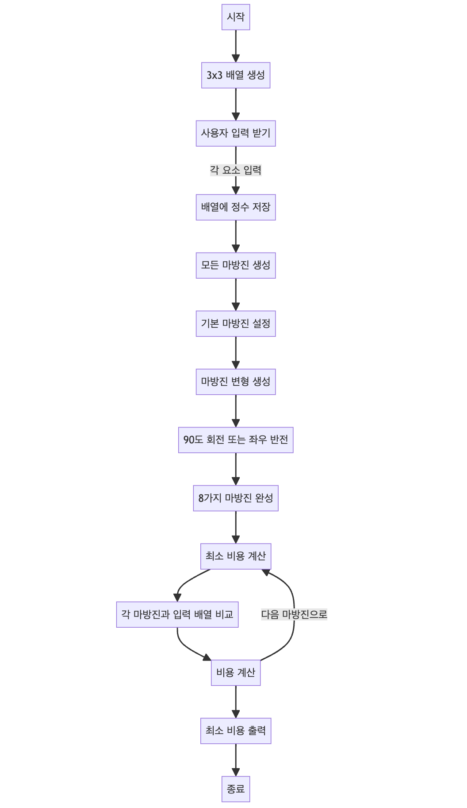

> [CH01_탐색_PART1](../) / [02_2차원_배열](./)

# BOJ_16945 : 매직 스퀘어로 변경하기
> https://www.acmicpc.net/problem/16945

## 설계
- 3 x 3 매직 스퀘어(마방진)을 만족시키는 2차원 배열 목록을 만든다.
- 입력 받은 배열을 정답 배열과 비교하면서 가장 적은 비용을 확인한다.

## 구현


## 코드
### Java
```java
// package boj16945; // 패키지 선언

import java.util.Scanner; // 사용자 입력을 위한 Scanner 클래스 임포트
// import java.util.Arrays; // 배열을 문자열로 출력하기 위해 Arrays 클래스 임포트

public class Main {
	public static void main(String[] args) {
	
		Scanner scanner = new Scanner(System.in); // 사용자 입력을 받기 위한 Scanner 객체 생성
		int[][] arr = new int[3][3]; // 3x3 배열 생성

		// 사용자로부터 9개의 정수를 입력받아 arr 배열에 저장
		for (int i = 0; i < 3; i++) {
			for (int j = 0; j < 3; j++) {
				int el = scanner.nextInt(); // 정수 입력 받음
				// System.out.print(el); // 입력 받은 정수 출력
				arr[i][j] = el; // 배열에 정수 저장
			}
			// System.out.println(); // 한 행이 끝날 때마다 줄바꿈
		}
		// 모든 마방진을 생성하여 저장
		int[][][] squares = getSquares(); // 8가지 마방진을 저장하는 배열
		int minCost = Integer.MAX_VALUE; // 최소 비용을 위한 변수, 매우 큰 값으로 초기화

		// 입력받은 배열을 마방진으로 만들기 위한 최소 비용 계산
		for (int i = 0; i < 8; i++) {
			int[][] s = squares[i]; // i번째 마방진 선택
			int cost = 0; // 해당 마방진으로 변환하기 위한 비용
			// 배열의 각 요소에 대해 비용 계산
			for (int j = 0; j < 3; j++) {
				for (int k = 0; k < 3; k++) {
					cost += Math.abs(s[j][k] - arr[j][k]); // 원소 간 차이의 절대값을 비용에 더함
				}
			}			
			// 최소 비용 갱신
			minCost = minCost > cost ? cost : minCost;
		}
		System.out.println(minCost); // 최소 비용 출력
		scanner.close(); // Scanner 객체 닫음
	}
	
	// 3x3 마방진의 모든 변형을 생성하는 메소드
	public static int[][][] getSquares() {
		// 기본 마방진 설정
		int[][] ms = {
				{8, 3, 4},
				{1, 5, 9},
				{6, 7, 2}
			};
		// 8가지 마방진을 저장할 배열
		int[][][] msArr = new int[8][3][3];
		for (int i = 0; i < 8; i++) {
			if (i == 0) {				
				msArr[i] = ms.clone(); // 첫번째는 기본 마방진
			} else {				
				int[][] rt = new int[3][3]; // 변형된 마방진을 저장할 임시 배열
				if (i < 4) {				
					// 이전 마방진을 90도 시계방향으로 회전하여 저장
					for (int j = 0; j < 3; j++) {
						for (int k = 0; k < 3; k++) {
							rt[k][2-j] = msArr[i-1][j][k];
						}
					}
				} else {
					// 이전 마방진을 좌우 반전하여 저장
					for (int j = 0; j < 3; j++) {
						for (int k = 0; k < 3; k++) {
							rt[j][2-k] = msArr[i-4][j][k];
						}
					}
				}
				msArr[i] = rt.clone(); // 생성된 마방진을 배열에 저장
			}
			// 변형된 마방진 출력
			// for (int[] r : msArr[i]) {
			// 	System.out.println(Arrays.toString(r)); // 배열을 문자열로 변환하여 출력
			// }
			// System.out.println(); // 마방진 사이에 줄바꿈
		}
		return msArr; // 모든 마방진 배열 반환
	}
}
```
### Python
```python
def get_squares():
    # 기본 마방진 설정
    ms = [
        [8, 3, 4],
        [1, 5, 9],
        [6, 7, 2]
    ]
    # 8가지 마방진을 저장할 리스트
    ms_arr = [ms]

    for i in range(1, 8):
        rt = [[0] * 3 for _ in range(3)]  # 변형된 마방진을 저장할 임시 리스트

        if i < 4:
            # 이전 마방진을 90도 시계방향으로 회전하여 저장
            for j in range(3):
                for k in range(3):
                    rt[k][2 - j] = ms_arr[i - 1][j][k]
        else:
            # 이전 마방진을 좌우 반전하여 저장
            for j in range(3):
                for k in range(3):
                    rt[j][2 - k] = ms_arr[i - 4][j][k]

        ms_arr.append(rt)  # 생성된 마방진을 리스트에 저장

    return ms_arr  # 모든 마방진 리스트 반환

def main():
    arr = [[0] * 3 for _ in range(3)]  # 3x3 배열 초기화

    # 사용자로부터 9개의 정수를 입력받아 arr 배열에 저장
    for i in range(3):
        row = list(map(int, input().split()))
        arr[i] = row

    squares = get_squares()  # 8가지 마방진을 저장하는 리스트 가져오기
    min_cost = float('inf')  # 최소 비용을 위한 변수, 매우 큰 값으로 초기화

    # 입력받은 배열을 마방진으로 만들기 위한 최소 비용 계산
    for s in squares:
        cost = 0  # 해당 마방진으로 변환하기 위한 비용
        # 배열의 각 요소에 대해 비용 계산
        for j in range(3):
            for k in range(3):
                cost += abs(s[j][k] - arr[j][k])  # 원소 간 차이의 절대값을 비용에 더함
        # 최소 비용 갱신
        min_cost = min(min_cost, cost)

    print(min_cost)  # 최소 비용 출력


if __name__ == "__main__":
    main()
```