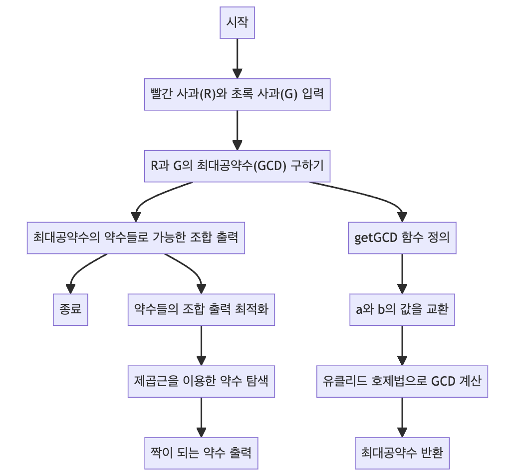

> [CH01_탐색_PART1](../) / [11_DAY01](./)

# BOJ_2942 : 퍼거슨과 사과
> https://www.acmicpc.net/problem/2942

## 설계
- 빨간 사과(R)와 초록 사과(G)를 일정한 수의 선수들에게 똑같이 나눠주되, 남는 사과가 없도록 하는 경우의 수를 구하는 문제를 해결
- 문제의 핵심은 "모든 선수에게 같은 수의 사과를 나눠주면서 남는 사과가 없어야 한다"는 조건 → 이 조건을 만족시키기 위해 빨간 사과와 초록 사과의 수에 대한 최대공약수(Greatest Common Divisor, GCD)를 구하는 것이 중요
- 최대공약수(GCD)의 중요성
    - 같은 수의 사과 배분: 빨간 사과와 초록 사과를 모든 선수에게 같은 수로 나누어 주기 위해서는 두 사과 수의 공통된 약수가 필요 → 이 공통된 약수가 바로 최대공약수.
    - 남는 사과 없음: 두 사과 수를 그들의 최대공약수로 나누었을 때 나머지가 없어야 모든 사과를 정확하게 배분할 수 있음. 만약 최대공약수보다 작은 수로 나눈다면, 일부 사과가 남게 됨.
    - 배분 가능한 최대 선수 수: 최대공약수는 두 사과 수를 나눌 수 있는 가장 큰 수. 상대적으로 작은 선수 쪽을 최대공약수로 나눠서 분배 가능한 최대 선수 수를 찾을 수 있음
- 최대공약수 구하기
    - 유클리드 호제법을 사용하여 두 수의 최대공약수를 구함.
    - 두 수 a와 b가 주어졌을 때, a를 b로 나눈 나머지를 새로운 b로 하여 계속 나누는 과정을 반복. 나머지가 0이 되었을 때의 b가 두 수의 최대공약수.
- 최대공약수를 이용한 사과 배분
    - 최대공약수와 그 약수들을 이용하여 빨간 사과와 초록 사과를 나눌 수 있는 모든 방법을 찾음. 예를 들어, 최대공약수가 4라면, 1, 2, 4가 약수가 되며, 이는 각각 4명, 2명, 1명의 선수에게 사과를 나눠줄 수 있는 경우를 의미.
    - 각 경우에 대해 빨간 사과와 초록 사과를 선수 수로 나눈 수를 출력하여 가능한 모든 배분 방법을 출력
- 최대 공약수의 약수들을 찾을 때, 제곱근을 이용하여 약수의 범위를 제한
    - 약수들이 쌍을 이루는 성질을 활용한 것으로, 최대 공약수의 제곱근까지만 검사하면 모든 약수를 찾을 수 있음
    - 예를 들어, 최대 공약수가 36이라면 1, 2, 3, 4, 6만 검사하면 되고, 이들의 짝이 되는 약수는 각각 36, 18, 12, 9, 6이 됨. 이렇게 하면 계산 효율성이 크게 향상.

## 구현


## 코드
### Java
```java
// package boj2942; // 패키지 선언

import java.util.Scanner; // Scanner 클래스 임포트

public class Main {
    // 메인 메소드
    public static void main(String[] args) {
        // 사용자 입력을 받기 위한 Scanner 객체 생성
        Scanner scanner = new Scanner(System.in);
        int R = scanner.nextInt(); // 빨간 사과의 수 R 입력 받기
        int G = scanner.nextInt(); // 초록 사과의 수 G 입력 받기
        scanner.close(); // Scanner 객체 닫기

        // R과 G의 최대 공약수를 구함
        int gcd = getGCD(R, G);

        // 최대 공약수의 약수들을 이용하여 가능한 조합을 출력
        for (int i = 1; i <= gcd; i++) {
            if (gcd % i != 0) continue; // i가 gcd의 약수가 아니면 건너뛰기
            // 선수의 수, 빨간 사과의 배분, 초록 사과의 배분 출력
            System.out.println(gcd / i + " " + R / gcd * i + " " + G / gcd * i);
        }
    }

    // 최대 공약수를 구하는 메서드
    public static int getGCD(int a, int b) {
        // a가 b보다 작은 경우 두 값을 교환
        if (a < b) {
            int temp = a;
            a = b;
            b = temp;
        }
        // 유클리드 호제법을 이용하여 최대 공약수 계산
        while (a % b != 0) {
            a = a % b;
            // a와 b의 값을 서로 교환
            int temp = a;
            a = b;
            b = temp;
        }
        // 최대 공약수 반환
        return b;
    }
}
```
### Python
```python
from math import gcd, sqrt

# 두 숫자 R과 G를 입력받음 (빨간 사과와 초록 사과의 수)
R, G = map(int, input().split())

# R과 G의 최대 공약수를 계산
_gcd = gcd(R, G)

# 최대 공약수의 제곱근을 계산하여 그 이하의 숫자까지만 반복할 범위 설정
# 최대 공약수의 모든 약수를 찾기 위한 최적화된 방법
limit = int(sqrt(_gcd)) + 1

# 1부터 limit까지의 모든 숫자에 대해 반복
for i in range(1, limit):
    # i가 최대 공약수의 약수인지 확인
    if _gcd % i == 0:
        # 약수인 경우, 선수의 수와 각 사과 수를 계산하여 출력
        # _gcd // i: 선수의 수, R // _gcd * i: 빨간 사과 수, G // _gcd * i: 초록 사과 수
        print(f'{_gcd // i} {R // _gcd * i} {G // _gcd * i}')

        # i가 최대 공약수의 절반 이하일 때만, 짝이 되는 약수에 대해서도 계산
        if i != _gcd // i:
            j = _gcd // i
            # j: 선수의 수, R // _gcd * j: 빨간 사과 수, G // _gcd * j: 초록 사과 수
            print(f'{i} {R // _gcd * j} {G // _gcd * j}')
```