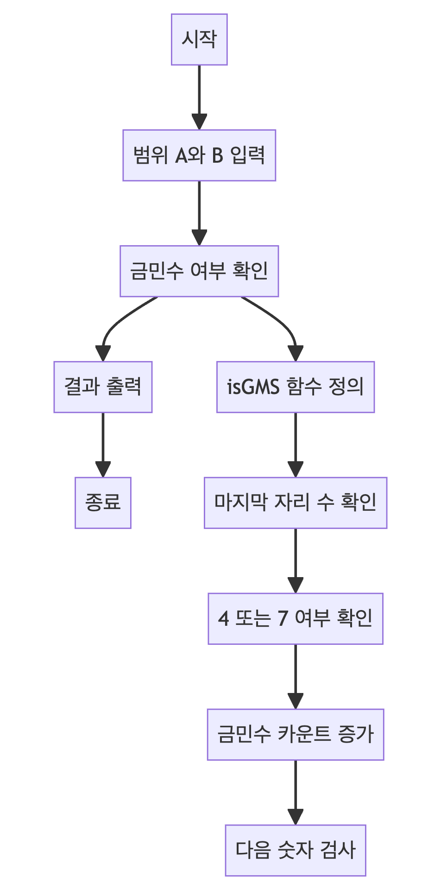
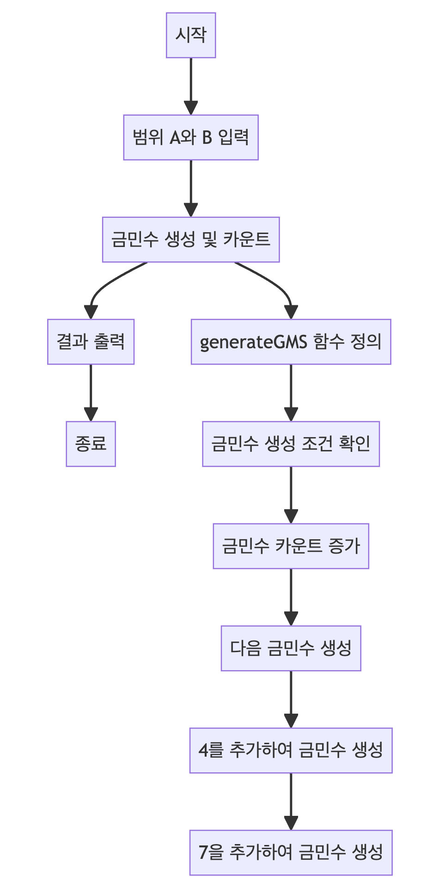

> [CH01_탐색_PART1](../) / [12_DAY02](./)

# BOJ_1527 : 금민수의 개수
> https://www.acmicpc.net/problem/1527

## 설계
- 주어진 범위 내에서 "금민수"를 찾는 문제를 해결
    - 금민수란 숫자 4와 7로만 이루어진 숫자를 의미. 예를 들어, 4, 7, 47 등은 금민수.
- 모든 수를 검사
    - 주어진 숫자가 금민수인지 판별합니다. 숫자를 10으로 나눈 나머지가 4 또는 7이 아닐 경우, 금민수가 아닙니다.
- 백트래킹을 통한 금민수 생성: generateGMS 메소드를 호출하여 재귀적으로 금민수를 생성합니다.
    - 재귀적으로 금민수를 생성합니다. 시작 숫자로 4와 7을 사용하고, 각 단계에서 숫자의 끝에 4 또는 7을 추가하여 새로운 금민수를 만듭니다.
- 첫 번째 방법 (모든 수를 검사):
    - 이 방법은 A에서 B까지 모든 숫자를 순회하며 금민수인지 확인합니다.
    - 시간 복잡도는 O(N)입니다. 여기서 N은 B - A의 범위를 의미합니다.
    - 숫자가 커질수록 계산 시간이 급격히 증가합니다.
- 두 번째 방법 (백트래킹을 이용한 금민수 생성):
    - 이 방법은 백트래킹을 이용하여 금민수를 직접 생성합니다.
    - 시간 복잡도는 금민수의 개수에 비례합니다. 따라서 O(1)에서 O(2^N) 사이입니다.
    - 금민수의 범위가 작고, 생성해야 하는 금민수의 수가 적을 때 빠른 계산이 가능합니다.
-  두 번째 방법이 첫 번째 방법보다 일반적으로 효율적입니다. 특히 금민수의 범위가 넓고, 금민수의 개수가 상대적으로 적을 때 더욱 그렇습니다. 첫 번째 방법은 간단하지만, 숫자 범위가 넓어질수록 계산 시간이 급증하는 단점이 있습니다.

## 구현



## 코드
### Java
```java
// package boj1527; // 패키지 선언

import java.util.Scanner; // Scanner 클래스 임포트

public class Main {
    static int A, B, count; // 전역 변수 선언: 시작 범위 A, 끝 범위 B, 금민수의 개수 count

    // 메인 메소드
    public static void main(String[] args) {
        Scanner sc = new Scanner(System.in); // 사용자 입력을 받기 위한 Scanner 객체 생성
        A = sc.nextInt(); // 시작 범위 A 입력 받기
        B = sc.nextInt(); // 끝 범위 B 입력 받기
        sc.close(); // Scanner 객체 닫기

        // 1번 방법: A와 B 사이의 모든 수를 순회하며 금민수 여부 확인
        // System.out.println("1. A와 B 사이의 모든 수를 검사하는 방법");
        // count = 0;
        // for (int i = A; i <= B; i++) {
        //     if (isGMS(i)) { // i가 금민수인지 확인
        //         System.out.println(i + " is GMS");
        //         count++;
        //     }
        // }
        // System.out.println(count);

        // 2번 방법: 백트래킹을 사용하여 금민수 생성
        // System.out.println("2. 순열을 통한 백트래킹으로 미리 금민수를 생성하는 방법");
        count = 0;
        generateGMS(4); // 4로 시작하는 금민수 생성
        generateGMS(7); // 7로 시작하는 금민수 생성
        System.out.println(count);
    }

    // 금민수인지 확인하는 메서드
    public static boolean isGMS(int num) {
        while (num > 0) {
            int remain = num % 10; // 마지막 자리 수 확인
            if (remain != 4 && remain != 7) { // 4 또는 7이 아니면 false 반환
                return false;
            }
            num /= 10; // 다음 자리 수 확인을 위해 10으로 나눔
        }
        return true; // 모든 자리 수가 4 또는 7이면 true 반환
    }

    // 백트래킹을 사용하여 금민수를 생성하는 메서드
    public static void generateGMS(long num) {
        if (num > B) { // 생성된 숫자가 B를 초과하면 더 이상 진행하지 않음
            return;
        }
        if (num >= A) { // 생성된 숫자가 A 이상이면 금민수로 간주
            System.out.println(num + " is GMS");
            count++;
        }
        generateGMS(num * 10 + 4); // 다음 숫자를 생성하기 위해 4를 추가
        generateGMS(num * 10 + 7); // 다음 숫자를 생성하기 위해 7을 추가
    }
}
```
### Python
```python
# 카드 합 중 최댓값을 찾는 함수
def combinate(cards, tmp, index, depth):
    global max_sum
    
    # 3장의 카드를 모두 골랐을 때
    if depth == 3:
        sum_tmp = sum(tmp)  # 현재 조합의 합 계산
        # 합이 M 이하이고 현재까지의 최대합보다 크면 갱신
        if M >= sum_tmp > max_sum:
            max_sum = sum_tmp  # 최대합 갱신
        return
    
    # 모든 카드를 확인했으면 반환
    if index == N:
        return
    
    # 현재 카드를 선택하지 않고 다음 카드 확인
    combinate(cards, tmp, index + 1, depth)
    
    # 현재 카드를 선택하고 다음 카드 확인
    tmp[depth] = cards[index]
    combinate(cards, tmp, index + 1, depth + 1)

# 입력 받기
N, M = map(int, input().split())  # 카드의 수 N과 목표 합 M 입력 받기
cards = list(map(int, input().split()))  # 카드 숫자들을 리스트로 입력 받기
max_sum = 0  # M에 가장 가까운 카드 합을 저장할 변수 초기화

# 조합 생성 함수 호출
combinate(cards, [0] * 3, 0, 0)

# 결과 출력
print(max_sum)
```