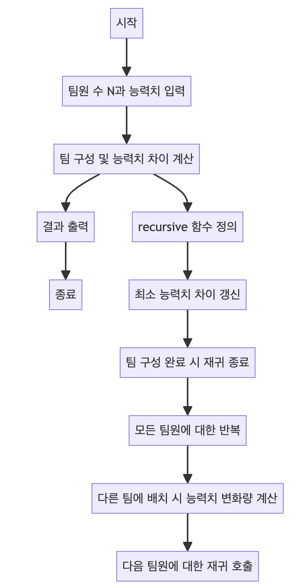

> [CH01_탐색_PART1](../) / [13_DAY03](./)

# BOJ_15661 : 링크와 스타트
> https://www.acmicpc.net/problem/15661

## 설계
- N명의 팀원들 사이의 능력치 차이를 최소화하는 문제
	- 문제 해결을 위해 백트래킹 알고리즘을 사용
	- 각 팀원들의 능력치는 2차원 배열 S에 저장되며, 두 팀 간의 능력치 차이는 재귀적으로 계산
- 재귀 메소드 recursive:
	- start와 depth를 매개변수로 하여 현재 팀 구성과 깊이를 추적
	- 현재 구성의 능력치 차이(currentScore)를 계산하고, 이를 minDiff와 비교하여 최소값을 갱신
	- depth가 N / 2에 도달하면 재귀를 종료
	- start부터 N까지 반복하며, 현재 팀원을 다른 팀에 할당하고 능력치 차이를 업데이트한 후, 재귀적으로 다음 팀 구성을 탐색
- 시간 복잡도
	- 이 코드의 시간 복잡도는 주로 recursive 메소드에 의해 결정.
	- 백트래킹 과정에서 N의 절반까지 조합을 생성하므로, 최악의 경우 시간 복잡도는 O(2^(N/2))가 될 수 있음


## 구현


## 코드
### Java
```java
// package boj15661; // 패키지 선언

import java.util.*;

class Main {
    static int N; // 팀원의 수
    static int[][] S; // 각 팀원 간의 능력치를 저장하는 2차원 배열
    static long minDiff = 0; // 최소 능력치 차이를 저장할 변수

    public static void main(String[] args) {
        Scanner sc = new Scanner(System.in);
        N = sc.nextInt(); // 사용자로부터 팀원의 수를 입력받음
        S = new int[N][N]; // 능력치 배열을 크기 N으로 초기화

        // 팀원들 간의 능력치를 입력받음
        for (int i = 0; i < N; i++) {
            for (int j = 0; j < N; j++) {
                S[i][j] = sc.nextInt();
                minDiff += S[i][j]; // 전체 능력치 합을 minDiff에 누적
            }   
        }
        sc.close(); // Scanner 사용 종료

        // 재귀함수를 이용하여 가능한 모든 팀 구성을 탐색하고 능력치 차이를 계산
        recursive(0, 0, minDiff);
        System.out.println(minDiff); // 계산된 최소 능력치 차이 출력
    }

    // 팀 구성을 재귀적으로 탐색하는 함수
    static void recursive(int start, int depth, long currentScore) {
        minDiff = Math.min(minDiff, Math.abs(currentScore)); // 최소 능력치 차이 갱신
        if (depth == N / 2) return; // 팀 구성이 완료되면 재귀 종료

        // start부터 N까지 모든 팀원에 대해 반복
        for (int i = start; i < N; i++) {
            int opponent = 0; // 현재 팀원이 다른 팀에 속했을 때 능력치의 변화량
            // 현재 팀원을 다른 팀에 배치했을 때의 능력치 차이를 계산
            for (int j = 0; j < N; j++) {
                opponent += S[j][i] + S[i][j];
            }
            // 다음 팀원에 대해 재귀 호출
            recursive(i + 1, depth + 1, currentScore - opponent);
        }
    }
}
```
### Python
```python
import sys
# 빠른 입력을 위한 설정
input = sys.stdin.readline

# 모인 사람 (N명)
N = int(input())

# 능력치 쌍 (S)
S = [list(map(int, input().split())) for _ in range(N)]

# 최소 능력치 차이 -> 초기값 = 모든 행렬의 합
min_diff = sum([sum(S[i]) for i in range(N)])

# 재귀 로직 정의
def recursive(start, depth, current_score):
    global min_diff # 전역 변수 min_diff 사용
    # 최소 차이 갱신
    min_diff = min(min_diff, abs(current_score))

    # 쌍을 이루므로 절반만 진행
    if depth == N // 2: return # 팀이 절반으로 나뉘었을 때 종료

    # start부터 N까지 모든 팀원에 대해 반복
    for i in range(start, N):
        # i번째 사람이 상대편이라면 해당되는 점수 계산
        opponent = sum([S[j][i] + S[i][j] for j in range(N)])
        # 그 경우의 상대방 점수를 빼주고 그 상태를 백트래킹
        recursive(i + 1, depth + 1, current_score - opponent)

# 재귀 로직 호출
recursive(0, 0, min_diff)

# 최종적으로 계산된 최소 능력치 차이 출력
print(min_diff)
```