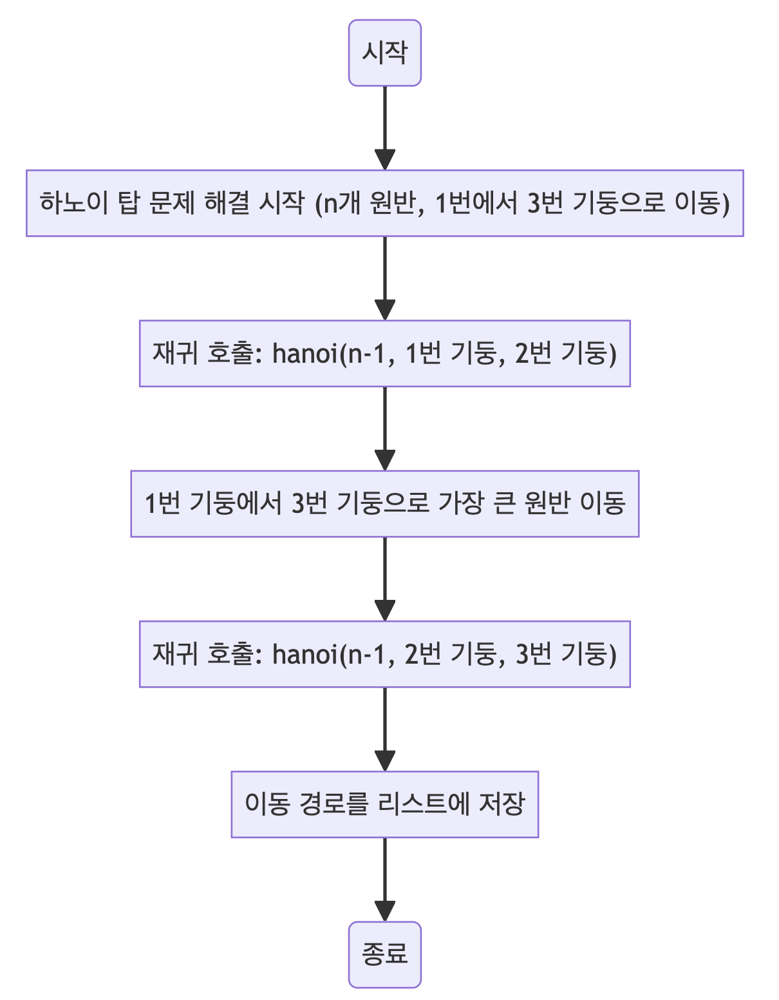

> [CH01_탐색_PART1](../) / [14_DAY04](./)

# 프로그래머스 : 하노이의 탑
> https://school.programmers.co.kr/learn/courses/30/lessons/12946

## 설계
- 재귀적으로 가장 큰 원판을 목적지 기둥으로 옮기고, 나머지 원판들을 중간 기둥을 이용해 재배치하는 과정을 반복
    - n 개의 원판을 from 기둥에서 to 기둥으로 이동시키는 로직을 재귀적으로 구현합니다.
    - n == 1인 경우, 가장 작은 원판을 바로 to 기둥으로 옮깁니다.
    - n > 1인 경우, n - 1개의 원판을 보조 기둥(여기서는 6 - from - to로 계산)으로 옮기고, 가장 큰 원판을 to 기둥으로 옮긴 후, 보조 기둥에 있는 원판들을 다시 to 기둥으로 옮깁니다.


## 구현


## 코드
### Java
```java
import java.util.*;

public class Solution {
    // 이동 경로를 저장할 리스트
    static List<int[]> list = new ArrayList<>();

    // 하노이 탑 문제를 해결하는 메소드
    public static int[][] solution(int n) {
        // 하노이 탑 알고리즘 수행
        hanoi(n, 1, 3); // n개의 원반을 1에서 3으로 이동
        // 결과를 2차원 배열로 변환하여 반환
        return list.toArray(new int[list.size()][2]);
    }

    // 하노이 탑 재귀 알고리즘 메소드
    public static void hanoi(int n, int from, int to) {
        // 기본 케이스: 하나의 원판만 옮길 경우
        if (n == 1) {
            // 그냥 이동하면 됨
            // System.out.println(from + " " + to);
            list.add(new int[] {from, to});
            return;
        }
        // n-1개의 원판을 보조 기둥으로 이동 (중간 기둥 번호는 1, 2, 3의 합에서 from과 to를 뺀 것)
        hanoi(n - 1, from, 6 - from - to);
        // 가장 큰 원판을 목적지 기둥으로 이동
        list.add(new int[] {from, to});
        // System.out.println(from + " " to);
        // 보조 기둥에 있는 n-1개의 원판들을 목적지 기둥으로 이동
        hanoi(n - 1, 6 - from - to, to);
    }
}
```
### Python
```python
def solution(n):
    # 이동 경로를 저장할 리스트
    answer = []

    # 하노이 탑 재귀 함수 정의
    def hanoi(n, from_poll, to_poll):
        # 기본 경우: 단 하나의 원판만 옮길 때
        if n == 1:
            # 현재 이동 단계를 answer 리스트에 추가
            answer.append([from_poll, to_poll])
            return

        # 보조 기둥 번호 계산 (1, 2, 3 합에서 출발 및 목표 기둥 번호 제외)
        sub_poll = 6 - from_poll - to_poll

        # n-1개의 원판을 보조 기둥으로 이동
        hanoi(n-1, from_poll, sub_poll)

        # 가장 큰 원판을 목표 기둥으로 이동
        answer.append([from_poll, to_poll])

        # 보조 기둥에 있는 n-1개의 원판을 목표 기둥으로 이동
        hanoi(n-1, sub_poll, to_poll)

    # 하노이 탑 문제 해결 시작
    hanoi(n, 1, 3)

    # 최종 이동 경로 반환
    return answer
```