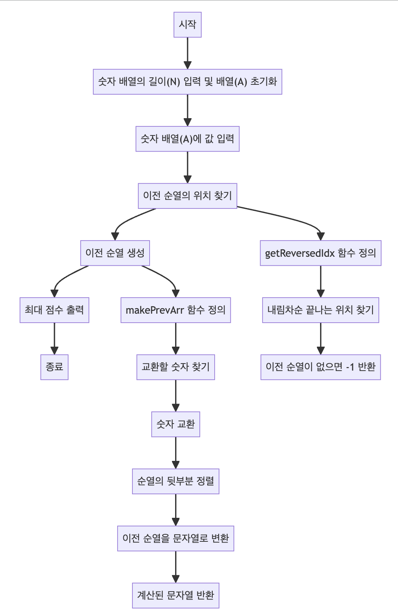

> [CH01_탐색_PART1](../) / [15_DAY05](./)

# BOJ_10973 : 이전 순열
> https://www.acmicpc.net/problem/10973

## 설계
- 주어진 순열에서 바로 이전 순열로 변경할 위치를 찾은 후, 해당 위치와 교환할 숫자를 찾아 순열을 변경
- 순열 변경은 주어진 순열을 뒤에서부터 탐색하여 처음으로 내림차순이 끝나는 위치를 찾고, 그 위치의 바로 앞 숫자와 교환할 숫자를 찾아 순열을 변경하는 방식으로 진행
- 변경된 순열의 뒷부분은 내림차순으로 정렬하여 이전 순열을 완성
 
## 구현


## 코드
### Java
```java
// package boj10973; // 패키지 선언

import java.util.ArrayList; // ArrayList 사용을 위한 import
import java.util.Arrays; // Arrays 사용을 위한 import
import java.util.Collections; // Collections 사용을 위한 import
import java.util.List; // List 사용을 위한 import
import java.util.Scanner; // Scanner 사용을 위한 import

public class Main {
	
	static int arr[]; // 전역 변수로 숫자 배열 선언

	// 메인 메소드
	public static void main(String[] args) {
		 Scanner scanner = new Scanner(System.in); // 사용자 입력을 받기 위한 Scanner 객체 생성
		 int N = scanner.nextInt(); // 숫자 배열의 길이 N 입력
		 arr = new int[N]; // 숫자 배열 arr 초기화
		 // 숫자 배열 arr에 값 입력
		 for (int i = 0; i < N; i++) {
			 arr[i] = scanner.nextInt(); // 입력된 숫자를 배열에 저장
		 }
		 scanner.close(); // Scanner 객체 닫기
		 
		 // 바로 이전 순열의 위치 찾기
		 int idx = getRevesedIdx();
		 // 이전 순열이 없는 경우 -1 출력
		 if (idx == -1) {
			 System.out.println(-1);
			 return;
		 }
		 // 이전 순열 생성 후 출력
		 System.out.println(makePrevArr(idx));
	}
	
	// 주어진 순열에서 바로 이전 순열로 변경할 위치를 찾는 메소드
	public static int getRevesedIdx() {
		int k;
		// 뒤에서부터 탐색하며 순열 변경 시작점 찾기
		for (int i = 1; i < arr.length; i++) {
			k = arr.length - i; // 뒤에서부터 k-1, k를 묶어줌.
			// 뒤로부터 탐색 시 내림차순이 끝나는 지점 찾기
			// 실제로는 앞으로부터 보았을 때 오름차순이 종료되는 지점.
			if (arr[k-1] > arr[k]) {
				return k;
			}
		}
		// 이전 순열이 없으면 -1 반환
		return -1;
	}
	
	// 이전 순열을 만드는 메소드
	public static String makePrevArr(int idx) {
		int r = 0;
		int tmp;
		// 찾은 위치의 바로 앞 숫자와 교환할 숫자 찾기
		while (true) {
			r++;
			// 교환할 숫자 찾으면 교환 후 반복 종료
			if (arr[idx-1] > arr[arr.length - r]) {
				tmp = arr[arr.length - r];
				arr[arr.length - r] = arr[idx-1];
				arr[idx-1] = tmp;
				break;
			}
		}
		
		// 이전 순열을 문자열로 변환
		List<Integer> list = new ArrayList<>();
		// 변경 지점까지의 배열 복사
		int[] arr1 = Arrays.copyOfRange(arr, 0, idx);
		Arrays.stream(arr1).forEach((el) -> list.add(el));
		// 변경 지점 이후 배열을 내림차순으로 정렬하여 복사
		int[] arr2 = Arrays.copyOfRange(arr, idx, arr.length);
		Arrays.stream(arr2).boxed()
			.sorted(Collections.reverseOrder())
			.forEach((el) -> list.add(el));
		// 리스트를 공백으로 구분된 문자열로 변환
		String s = "";
		for (int l : list) {
			s += l;
			s += " ";
		}
		return s.strip(); // 문자열 반환
	}
}

/*

# 해법의 원리:

## 사전식 순서:
숫자들의 전체적인 배열 순서가 순열의 크기를 결정합니다.
따라서 순열을 '사전에서 바로 이전 단어 찾기'와 같은 방식으로 접근할 수 있습니다.

## 최소 변경 원칙:
이전 순열을 찾기 위해서는 가능한 한 뒤쪽에서만 변경을 가하며,
변경된 순열이 바로 이전 순서가 되도록 합니다.

# 이전 순열을 찾는 과정

## 내림차순 끝나는 위치 찾기:
주어진 순열을 뒤에서부터 앞으로 확인하면서 처음으로 내림차순이 끝나는 위치를 찾습니다.
이 위치는 순열에서 '교환 가능성'이 있는 첫 번째 지점입니다.
여기서 내림차순이 끝난다는 것은, 이 지점부터 순열을 더 작게 만들 수 있는 여지가 있다는 뜻입니다.

## 교환할 숫자 찾기:
찾은 위치 바로 앞의 숫자(arr[idx-1])는 '교환 지점'입니다.
이 숫자보다 작은, 가장 큰 숫자를 순열의 뒷부분에서 찾아 두 숫자를 교환합니다.
이렇게 하면 교환 지점의 숫자가 감소하여 순열의 크기가 작아집니다.

## 순열의 뒷부분 정렬:
교환으로 인해 순열의 뒷부분이 뒤죽박죽될 수 있습니다.
순열의 크기를 최소화하기 위해, 교환 지점 이후의 숫자들을 내림차순으로 정렬합니다.
이 정렬은 순열의 크기가 최대한 작아지도록 보장합니다.
왜냐하면 사전 순으로 바로 이전이 되려면 가능한 한 '뒤에서부터' 큰 숫자가 나와야 하기 때문입니다.
 
*/
```
### Python
```python
# 주어진 배열에서 이전 순열을 찾기 위한 함수입니다.
def seperate(arr, c):
    # 배열의 뒤에서부터 앞으로 이동하면서
    for i in range(1, c):
        n = c - i
        # 순서가 감소하는 지점을 찾습니다.
        if arr[n-1] > arr[n]: return n
    # 찾지 못했으면 -1을 반환합니다 (더 이상 이전 순열이 없음).
    return -1

# n 위치에서 순서를 바꾼 후 배열의 나머지 부분을 역순으로 정렬합니다.
def find(arr, n):
    r = 0
    while True:
        r -= 1
        # 오른쪽부터 왼쪽으로 이동하며 arr[n-1]보다 작은 첫 번째 원소를 찾습니다.
        if arr[n-1] > arr[r]:
            # 원소를 서로 교환합니다.
            tmp = arr[r]
            arr[r] = arr[n-1]
            arr[n-1] = tmp
            # 배열의 앞부분은 그대로 두고, n 이후 부분은 역순으로 정렬하여 반환합니다.
            return arr[0:n] + sorted(arr[n:], reverse=True)

# 입력을 받습니다. c는 배열의 길이, arr는 배열입니다.
c = int(input())
arr = [int(v) for v in input().strip().split()]

# 배열에서 이전 순열의 시작점을 찾습니다.
n = seperate(arr, c)
if(n != -1):
    # 시작점이 있다면, 이전 순열을 찾아 출력합니다.
    print(" ".join([str(i) for i in find(arr, n)]))
else: 
    # 더 이상 이전 순열이 없으면 -1을 출력합니다.
    print(n)
```