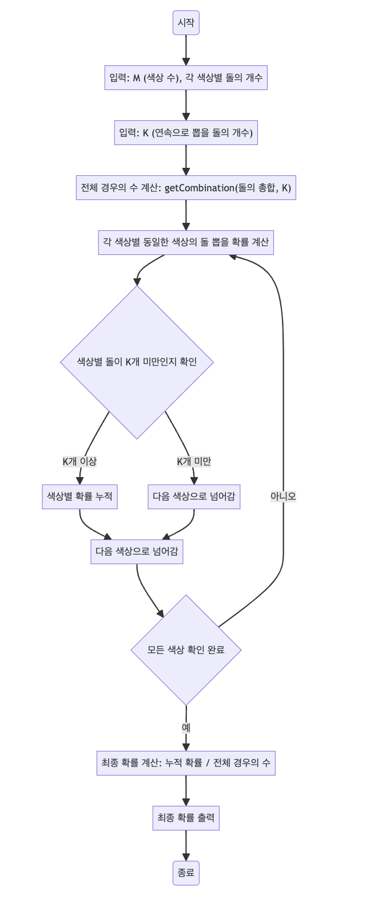

> [CH01_탐색_PART1](../) / [15_DAY05](./)

# BOJ_13251 : 조약돌 꺼내기
> https://www.acmicpc.net/problem/13251

## 설계
- 전체 경우의 수 계산: 상자에 있는 모든 돌들 중에서 K개를 뽑는 경우의 수(total)를 계산.
- 같은 색상의 돌을 뽑을 확률 계산: 각 색상별로 K개를 뽑을 경우의 확률을 계산하고, 이를 모두 더하여 총합(same)을 구함.
- 최종 확률 계산 및 출력: 같은 색상의 돌을 뽑을 총 확률(same)을 전체 경우의 수(total)로 나누어 최종 확률을 계산하고 출력.
- 조합 계산 함수 (getCombination): 조합(nCr)을 계산하기 위한 함수로, 더 큰 숫자에 대한 팩토리얼 계산을 피하기 위해 단순화된 조합 계산 방식을 사용.

## 구현


## 코드
### Java
```java
// package boj13251;

import java.util.*;
import java.util.stream.IntStream;

public class Main {
    public static void main(String[] args) {
        Scanner sc = new Scanner(System.in);
        int M = sc.nextInt(); // 상자에 있는 색상의 수
        // System.out.println(M);
        int[] colors = new int[M]; // 각 색상별 돌의 개수를 저장하는 배열

        // 각 색상별 돌의 개수를 입력받음
        for (int i = 0; i < M; i++) {
            colors[i] = sc.nextInt();
        }

        int K = sc.nextInt(); // 연속으로 뽑을 돌의 개수
        // System.out.println(M + " " + K);
        // System.out.println(Arrays.toString(colors));
        sc.close();

        // 전체 경우의 수 계산
        double total = getCombination(IntStream.of(colors).sum(), K);
        // System.out.println(total);

        double same = 0.0; // 동일한 색상의 돌을 뽑을 확률의 합
        // 각 색상별로 동일한 색상의 돌을 뽑을 확률을 계산
        for (int color : colors) {
            if (color < K) continue; // 해당 색상의 돌이 K개 미만이면 건너뜀
            double tmp = getCombination(color, K);
            // System.out.println(tmp);
            same += tmp; // 확률 누적
        }
        // System.out.println(same);

        // 최종 확률 계산 및 출력
        System.out.println(same / total);
    }

    // 조합을 계산하는 메서드: nCr = n! / (r! * (n-r)!)
    static double getCombination(int n, int r) {
        // 조합 nCr을 계산하는 메소드
        // nCr = n! / (r! * (n-r)!)
        // 이 식은 다음과 같이 변형될 수 있다:
        // nCr = (n * (n-1) * ... * (n-r+1)) / (r * (r-1) * ... * 1)
        // 예를 들어, 5C3 = (5 * 4 * 3) / (3 * 2 * 1)
        // 이는 큰 숫자에 대한 팩토리얼 계산을 피하기 위해 사용된다.
        // System.out.println("n : " + n + " r : " + r);
        double result = 1.0;
        for (int i = 0; i < r; i++) {
            result *= (n - i);
            result /= (i + 1);
        }
        return result;
    }    
}
```
### Python
```python
# 사용자로부터 색상의 수를 입력받음
M = int(input())
# 사용자로부터 각 색상별 돌의 개수를 입력받음
colors = list(map(int, input().split()))
# 사용자로부터 연속으로 뽑을 돌의 개수를 입력받음
K = int(input())
# print(M, colors, K)

# 조합을 계산하는 함수 정의
def get_combination(n, r):
    result = 1
    for i in range(r):
        result *= (n - i) # nCr의 분자 계산
        result /= (i + 1) # nCr의 분모 계산
    return result

# 모든 돌 중에서 K개를 뽑는 전체 경우의 수 계산
total = get_combination(sum(colors), K)
# print(total)

# 동일한 색상의 돌만을 연속으로 뽑는 경우의 수 계산
same = 0
for color in colors:
    if color < K: continue # 해당 색상의 돌이 K개 미만인 경우 건너뜀
    same += get_combination(color, K) # 같은 색상의 돌을 뽑는 경우의 수 누적
# print(same)

# 동일한 색상의 돌을 연속으로 뽑을 확률 계산 및 출력
print(same / total)
```