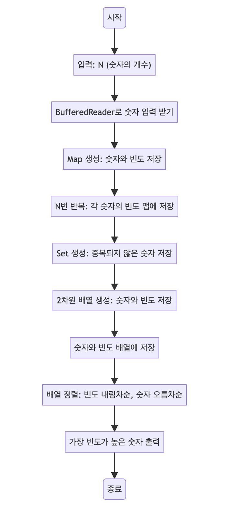

> [CH02_탐색_PART2](../) / [01_정렬](./)

# BOJ_11652 : 카드
> https://www.acmicpc.net/problem/11652

## 설계
- 주어진 숫자들 중 가장 많이 등장하는 숫자를 찾고, 동일한 빈도의 숫자가 여러 개 있는 경우에는 가장 작은 숫자를 출력합니다.
- 각 숫자의 등장 횟수를 저장하는 HashMap을 사용하여 숫자들의 빈도를 계산하고, 이를 기반으로 정렬하는 것입니다.
- 숫자와 빈도를 2차원 배열에 저장한 후, 빈도가 동일한 경우 숫자의 크기에 따라 오름차순으로, 빈도가 다른 경우 빈도에 따라 내림차순으로 정렬합니다.
- 그 후, 가장 첫 번째 원소(가장 많이 등장하거나 가장 작은 숫자)를 출력합니다.

## 구현


## 코드
### Java
```java
// package boj11652;

import java.util.*;
import java.io.*;

public class Main {
    public static void main(String[] args) throws Exception {
        // Scanner sc = new Scanner(System.in);
        // int N = sc.nextInt(); // 사용자로부터 숫자의 개수 N을 입력받음
        // 빠른 입력
        BufferedReader bf = new BufferedReader(new InputStreamReader(System.in));
        int N = Integer.parseInt(bf.readLine());
        Map<Long, Integer> map = new HashMap<>(); // 숫자와 그 빈도를 저장할 맵 생성

        // N번 반복하여 각 숫자의 빈도를 맵에 저장
        for (int i = 0; i < N; i++) {
            // 입력 받는 숫자는 -2^62 <= l <= 2^62 범위의 정수이므로 long을 사용해야함
            // long l = sc.nextLong(); // 사용자로부터 숫자를 입력받음
            long l = Long.parseLong(bf.readLine());
            // 적혀있을 수 있는 수의 범위가 2^63이므로 배열로 count하기에 적절하지 않음
            // -> 맵을 사용하여 숫자의 빈도를 저장
            // 맵에 숫자의 빈도를 저장하거나 업데이트
            map.put(l, map.getOrDefault(l, 0) + 1);
        }
        // sc.close();
        // System.out.println(map);

        // 숫자들을 저장할 집합 생성
        // keySet을 통해 맵의 키(중복되지 않은 숫자)를 순회할 수 있음
        Set<Long> unique = map.keySet();
        // 숫자와 빈도를 저장할 2차원 배열 생성
        long[][] arr = new long[unique.size()][2];
        // 숫자와 빈도를 순회하는 이터레이터 생성
        // 이터레이터 : next() 메서드를 통해 다음 요소를 가져올 수 있는 객체
        // 배열 등에 비해 메모리를 적게 사용하며, 요소를 순회하는데 유용함
        Iterator<Long> keys = unique.iterator();
        Iterator<Integer> values = map.values().iterator();

        // 숫자와 빈도를 배열에 저장
        // map으로 한 번 정리했기 때문에 최대 N개의 row를 가지는 2행의 배열을 생성
        for (int i = 0; i < map.keySet().size(); i++) {
            arr[i][0] = keys.next(); // 숫자 저장
            arr[i][1] = values.next(); // 빈도 저장
        }
        // System.out.println(Arrays.deepToString(arr));

        // 배열을 정렬
        // 오름차순? : 데이터가 나열되는 방향이 작은 것에서 큰 것으로 (1, 2, 3, 4, 5...)
        // 내림차순? : 데이터가 나열되는 방향이 큰 것에서 작은 것으로 (5, 4, 3, 2, 1...)
        // Arrays.sort 메서드를 통해 배열을 정렬할 수 있음
        // - 원본에 영향을 미치고, return이 없는 in-place 정렬
        Arrays.sort(arr, (a, b) -> {
            // 0 : 숫자, 1 : 빈도
            // 앞선 요소 a, 뒤에 있는 요소 b
            // 해당 요소가 자료구조일 경우 인덱스나 메서드를 통해 하위 데이터에 접근 가능
            if (a[1] == b[1]) {
                // 빈도가 동일할 경우 숫자 순으로 오름차순 정렬
                // Long.compare 메서드를 통해 두 숫자(long) 비교
                // (Integer.compare 메서드는 int를 비교)
                return Long.compare(a[0], b[0]);
                // a[0]가 b[0]보다 작으면 음수, 같으면 0, 크면 양수를 반환
            }
            // 빈도가 다를 경우 내림차순 정렬
            return Long.compare(b[1], a[1]);
            // b[1]가 a[1]보다 작으면 음수, 같으면 0, 크면 양수를 반환
        });
        // 가장 빈도가 높은 숫자 출력
        System.out.println(arr[0][0]);
    }
}
```
### Python
```python
import sys

# 빠른 입력을 위한 설정
input = lambda: sys.stdin.readline().rstrip()

# 사용자로부터 숫자의 개수 N을 입력받음
N = int(input())

# 숫자와 그 빈도를 저장할 딕셔너리 초기화
m = {}

# N번 반복하여 각 숫자의 빈도를 딕셔너리에 저장
for i in range(N):
    l = int(input()) # 사용자로부터 숫자를 입력받음
    # 딕셔너리에 숫자의 빈도를 저장하거나 업데이트
    m[l] = m.get(l, 0) + 1

# 딕셔너리의 아이템을 빈도와 숫자를 기준으로 정렬
# 빈도가 같을 경우 숫자가 큰 순서대로 정렬
sorted_items = sorted(m.items(), key=lambda x: (x[1], -x[0]))

# 가장 많이 등장하는 숫자 출력
# 빈도가 같은 경우에는 가장 큰 숫자를 출력
print(sorted_items[-1][0])
```