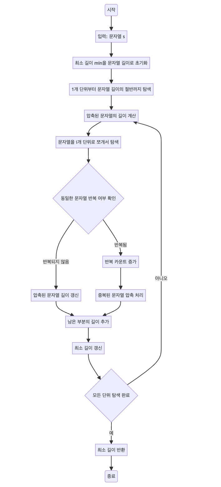

> [CH02_탐색_PART2](../) / [02_문자열](./)

# 프로그래머스 : 문자열 압축
> https://school.programmers.co.kr/learn/courses/30/lessons/60057

## 설계
- 주어진 문자열을 여러 길이 단위로 잘라서 각 단위별로 압축한 후 가장 짧은 압축 길이를 찾습니다.
- 문자열 압축 과정에서 동일한 문자열이 반복되는 경우 숫자를 이용하여 압축하고, 그렇지 않은 경우 원본 문자열을 사용합니다.
- 압축된 문자열의 최소 길이를 찾기 위해 모든 가능한 단위를 탐색하며, 각 단위별로 압축된 문자열의 길이를 계산하여 최소 길이를 갱신합니다.

## 구현


## 코드
### Java
```java
class Solution {
    public int solution(String s) {
        // 자기 자신의 길이가 최소값으로 설정
        int min = s.length();

        // 1개 단위부터 문자열 길이의 절반까지 탐색
        for (int i = 1; i <= s.length() / 2; i++) {
            int length = 0; // 압축된 문자열의 길이

            // 문자열을 i개 단위로 쪼개서 탐색
            for(int j = 0; j + i <= s.length();){
                int h = j + i; // 문자열 종료 지점
                int count = 1; // 반복 카운트
                String seg = s.substring(j, j + i); // 현재 탐색 중인 문자열

                // 현재 문자열과 다음 문자열이 일치할 경우 반복
                while(
                    h + i <= s.length() // 앞으로 문자열을 압축할 수 있는지 확인
                    && seg.equals(s.substring(h, h + i))
                ){
                    h += i; // 문자열 압축 단위만큼 커서를 옮김
                    count++; // 중복된 횟수 증가
                } 

                // 문자열 압축을 할 수 없거나, 반복이 멈춘 경우
                if(count == 1) {
                    length += i; // 중복 없이 단일 문자열이면 단위 길이만큼 추가
                } else {
                    // 중복된 문자열의 경우, 압축 단위 + 숫자의 길이 추가
                    length += i + String.valueOf(count).length();  
                }
                // 다음 탐색으로 이동
                j = h;
            }

            // 문자열이 i로 정확히 나눠지지 않는 경우 나머지 부분 처리
            if(s.length() % i != 0) {
                length += s.length() % i; // 남은 부분의 길이 추가
            }
            min = Math.min(min, length); // 최소 길이 갱신
        }

        return min; // 최소 길이 반환
    }
}
```
### Python
```python
def solution(s):
    # 자기 자신의 길이를 최소값으로 설정
    min_value = len(s);
    
    # 1개 단위부터 문자열 길이의 절반까지 탐색
    for i in range(1, len(s) // 2 + 1):
        length = 0 # 압축된 문자열의 길이
        
        # 문자열을 i개 단위로 쪼개서 탐색
        j = 0
        while j + i <= len(s): 
            h = j + i # 문자열 종료 지점
            count = 1 # 반복 카운트
            seg = s[j:j+i] # 현재 탐색 중인 문자열
        
            # 현재 문자열과 다음 문자열이 일치할 경우 반복
            # 앞으로 문자열을 압축할 수 있는지 확인
            while h + i <= len(s) and seg == s[h:h+i]:
                h += i # 문자열 압축 단위만큼 커서를 옮김
                count += 1 # 중복된 횟수 증가
        
            # 문자열 압축을 할 수 없거나, 반복이 멈춘 경우
            if count == 1:
                length += i; # 중복 없이 단일 문자열이면 단위 길이만큼 추가
            else:
                # 중복된 문자열의 경우, 압축 단위 + 숫자의 길이 추가
                length += i + len(str(count));  
            # 다음 탐색으로 이동
            j = h;
    
        # 문자열이 i로 정확히 나눠지지 않는 경우 나머지 부분 처리
        if len(s) % i != 0:
            length += len(s) % i # 남은 부분의 길이 추가
            
        min_value = min(min_value, length) # 최소 길이 갱신

    return min_value
```