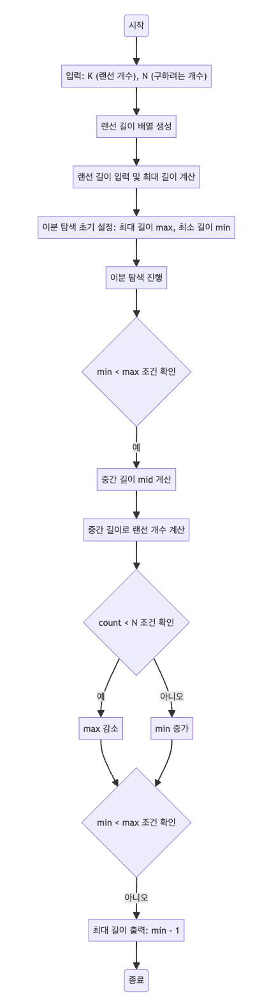

> [CH02_탐색_PART2](../) / [03_이진탐색](./)

# BOJ_1654 : 랜선 자르기
> https://www.acmicpc.net/problem/1654

## 설계
- 이분 탐색(Binary Search) 알고리즘을 사용하여 최적의 랜선 길이를 찾습니다.
- 이분 탐색은 주어진 범위를 반으로 나누어 탐색하는 방법으로, 효율적인 탐색을 가능하게 합니다.
- 이 경우, 랜선의 길이 범위를 절반씩 줄여가며 원하는 개수의 랜선을 만들 수 있는 최대 길이를 찾습니다.

## 구현


## 코드
### Java
```java
// pacakge boj1654;

import java.util.*;

public class Main {

    public static void main(String[] args) {
        // 입력 처리
        Scanner sc = new Scanner(System.in);

        // 주어진 랜선 K개
        int K = sc.nextInt();
        // 구하려는 개수 N개
        int N = sc.nextInt();

        // K개의 데이터 배열로 저장
        int[] arr = new int[K];

        // 최대 값 -> long 타입 사용 이유: max가 매우 클 수 있으므로 int 범위를 넘어갈 수 있음
        long max = 0;

        // 입력과 동시에 해당 랜선의 길이가 최댓값인지 확인하고 max를 갱신
        for (int i = 0; i < K; i++) {
            arr[i] = sc.nextInt();
            max = Math.max(max, arr[i]);
        }

        sc.close(); // 스캐너 종료

        // 이분 탐색을 위한 초기 설정
        max++; // 최대 길이보다 1 더 큰 값으로 설정
        long min = 0; // 탐색 시작 길이
        long mid = 0; // 중간 길이

        // 이분 탐색 진행
        while (min < max) {
            // 중간 길이 계산
            mid = (max + min) / 2;

            // 중간 길이로 잘랐을 때 만들어지는 랜선 개수 계산
            long count = 0;
            for (int i = 0; i < arr.length; i++) {
                count += (arr[i] / mid);
            }

            // 이분 탐색 조건 처리
            if (count < N) {
                // 원하는 개수보다 적게 만들어지면 길이를 줄임
                max = mid;
            } else {
                // 원하는 개수 이상으로 만들어지면 길이를 늘림
                min = mid + 1;
            }
        }

        // 최종적으로 탐색을 마치는 길이는 min과 max가 일치해서 더 이상 탐색되지 않는 길이
        // max는 탐색을 위한 범위를 만들어야하기 때문에 +1인 상태
        // 최적화된 길이에서 1을 뺀 값이 최대 길이
        System.out.println(min - 1);
    }
}
```

### Python
```python
# 입력 받기
K, N = map(int, input().split()) # K: 랜선의 개수, N: 필요한 랜선의 개수
arr = [int(input()) for _ in range(K)] # 각 랜선의 길이를 배열로 저장

# 최대 길이를 계산 (가장 긴 랜선의 길이 + 1)
max_val = max(arr) + 1

# 최소 길이를 0으로 설정
min_val = 0

# 이분 탐색 시작
while min_val < max_val:
    # 중간값 계산
    mid = (max_val + min_val) // 2

    # 현재 중간값으로 랜선을 잘랐을 때 얻을 수 있는 총 랜선의 개수 계산
    count = sum([arr[i] // mid for i in range(len(arr))])

    # 필요한 랜선 개수와 비교
    if count < N:
        # 현재 길이로는 필요한 개수만큼 만들 수 없으므로 최대 길이 감소
        max_val = mid
    else:
        # 필요한 개수 이상으로 만들 수 있으므로 최소 길이 증가
        min_val = mid + 1

# 이분 탐색 결과 출력
# 실제 최적 길이보다 1 큰 값에서 탐색이 종료되므로 1을 빼서 출력
print(min_val - 1)
```