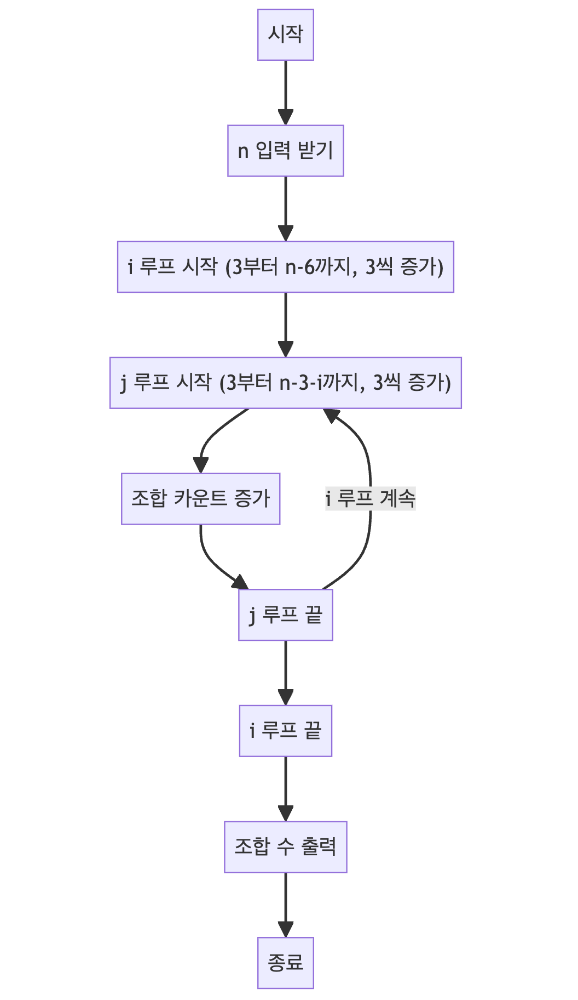

> [CH01_탐색_PART1](../) / [01_1차원_배열](./)

# BOJ_16561 : 3의 배수
> https://www.acmicpc.net/problem/16561

## 설계
- 3의 배수인 자연수를 3개의 3의 배수로 나눠지는 경우의 수를 구한다
- 주어진 자연수를 `n`, 3개의 수를 각각 `i`, `j`, `k`라고 할 때,
    - `i`와 `j`가 정해지면 `k`는 따라서 정해짐, 고로 `k`는 `n-i-j`
    - 3의 배수 3개로 나눠진다면...
        - `i`는 최소 3부터 최대 `n-6`의 범위를 갖게 됨 (`j`와 `k`의 최소치인 3씩을 남겨둬야 함)
        - `j`는 최소 3부터 최대 `n-3-i`의 범위를 갖게 됨 (`i`를 제외하고도 `k`의 최소치인 3을 남겨둬야 함)
    - `i`와 `j`가 for문의 조건을 충족시킨다면 3의 배수로 구성된 3개의 숫자로 `n`이 존재한다고 할 수 있음

## 구현


## 코드
### Java
```java
// package boj16561;

import java.util.Scanner;

public class Main {

    public static void main(String[] args) {
        Scanner scanner = new Scanner(System.in);
        int n = scanner.nextInt(); // 입력으로 정수 n을 받습니다.
        int cnt = 0; // 가능한 조합의 수를 저장할 변수입니다.

        // 3으로 시작해서 n - 6까지 3씩 증가하는 i 루프입니다.
        for (int i = 3; i <= n - 6; i += 3) {
            // 3으로 시작해서 n - 3 - i까지 3씩 증가하는 j 루프입니다.
            for (int j = 3; j <= n - 3 - i; j += 3) {
                // i, j, n - i - j가 3의 배수이면 조합으로 카운트합니다.
                cnt++;
            }
        }

        // 가능한 조합의 수를 출력합니다.
        System.out.println(cnt);
        scanner.close(); // 스캐너를 닫습니다.
    }
}
```

### Python
```python
n = int(input())  # 정수 n을 입력으로 받습니다.
cnt = 0  # 가능한 조합의 수를 저장할 변수입니다.

# 3으로 시작해서 n - 6까지 3씩 증가하는 i 루프입니다.
for i in range(3, n - 5, 3):
    # 3으로 시작해서 n - 3 - i까지 3씩 증가하는 j 루프입니다.
    for j in range(3, n - 2 - i, 3):
        # i, j, n - i - j가 3의 배수이면 조합으로 카운트합니다.
        if (i + j + (n - i - j)) % 3 == 0:
            cnt += 1

# 가능한 조합의 수를 출력합니다.
print(cnt)
```