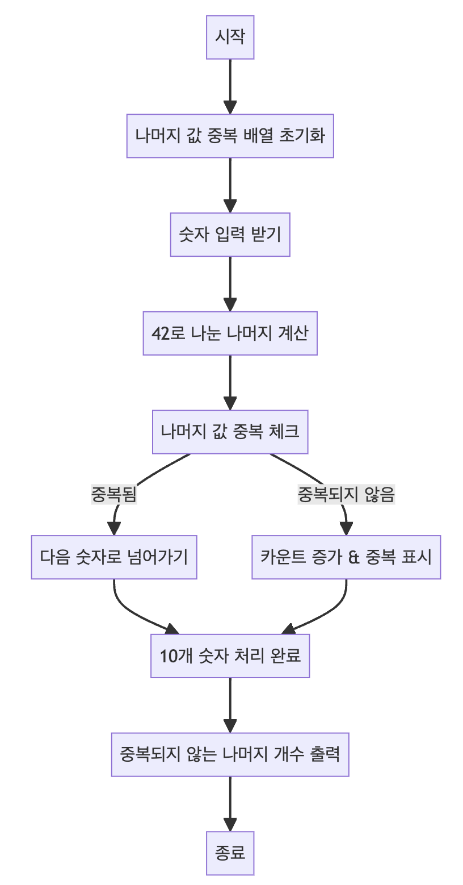

> [CH01_탐색_PART1](../) / [01_1차원_배열](./)

# BOJ_3052 : 나머지
> https://www.acmicpc.net/problem/3052

## 설계
- 입력받은 수를 42로 나눈 나머지 중 고유값의 개수를 구한다.
- 자연수로 된 특정 범위의 고유값을 구할 경우 중복 여부를 배열을 통해서 기록할 수 있다.

## 구현


## 코드
### Java
```java
// package boj3052;

import java.util.Scanner;
//import java.util.Arrays;

public class Main {

	public static void main(String[] args) {
		// 각 나머지 값의 중복 여부를 저장하는 배열
		boolean remain[] = new boolean[42];
		Scanner scanner = new Scanner(System.in);
		int cnt = 0;
		for (int i = 0; i < 10; i++) {
			// System.out.println(scanner.nextInt());
			// 10개의 숫자를 입력받아서 각 숫자를 42로 나눈 나머지를 계산하고 중복되지 않는 경우를 카운트합니다.
			int mod = scanner.nextInt() % 42;
			// System.out.println(mod);
			// 만약 나머지 값이 이미 체크되었다면 다음 반복으로 넘어갑니다.
			if (remain[mod]) {
				continue;
			}
			// 나머지 값이 중복되지 않으면 카운트를 증가시키고, 해당 나머지를 중복되었다고 표시합니다.
			cnt++;
			// 중복되지 않은 나머지를 true로 표시하여 중복 여부를 체크합니다.
			remain[mod] = true;
		}
		// System.out.println(Arrays.toString(remain));
        // 중복되지 않는 나머지의 개수를 출력합니다.
		System.out.println(cnt);
		scanner.close();
	}

}
```
### Python
```python
# 각 나머지 값의 중복 여부를 저장하는 리스트
remain = [False] * 42
cnt = 0

for i in range(10):
    # 10개의 숫자를 입력받아서 각 숫자를 42로 나눈 나머지를 계산합니다.
    mod = int(input()) % 42
    
    # 만약 나머지 값이 이미 체크되었다면 다음 반복으로 넘어갑니다.
    if remain[mod]:
        continue
    
    # 나머지 값이 중복되지 않으면 카운트를 증가시키고, 해당 나머지를 중복되었다고 표시합니다.
    cnt += 1
    # 중복되지 않은 나머지를 True로 표시하여 중복 여부를 체크합니다.
    remain[mod] = True

# 중복되지 않는 나머지의 개수를 출력합니다.
print(cnt)
```