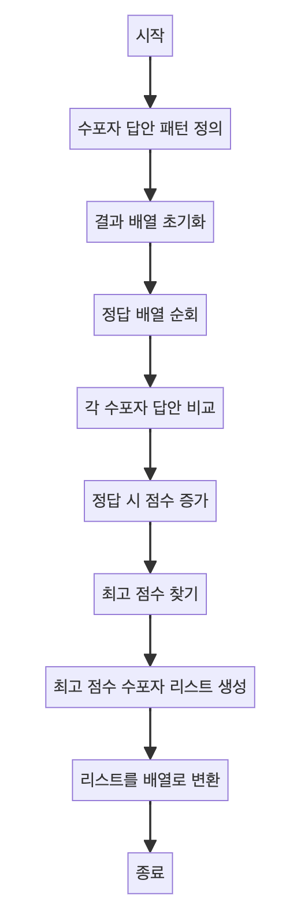

> [CH01_탐색_PART1](../) / [01_1차원_배열](./)

# 프로그래머스 : 모의고사
> https://school.programmers.co.kr/learn/courses/30/lessons/42840?language=java

## 설계
- 두 배열 간의 일치 여부를 판단하고 해당 결과 중 가장 높은 값을 찾아낸다.
- 삼항연산자, Stream API 등을 활용하여 코드를 더 간결하고 효율적으로 작성

## 구현


## 코드
### Java
```java
import java.util.Arrays;
import java.util.ArrayList;

public class Solution {
	public int[] solution(int[] answers) {
		// 세 수포자의 답안 패턴을 배열로 정의합니다.
        int[] s1 = {1, 2, 3, 4, 5};
        int[] s2 = {2, 1, 2, 3, 2, 4, 2, 5};
        int[] s3 = {3, 3, 1, 1, 2, 2, 4, 4, 5, 5};
        // 결과를 저장할 배열을 초기화합니다.
        int[] result = new int[3];
        for (int i = 0; i < answers.length; i++) {
            int a = answers[i];
            // System.out.println(a);
			// 각 수포자의 답안 패턴과 비교하여 정답일 경우 해당 수포자의 점수를 증가시킵니다.
            if (s1[i % 5] == a) {
                result[0]++;
            }
            if (s2[i % 8] == a) {
                result[1]++;
            }
            if (s3[i % 10] == a) {
                result[2]++;
            }
        }
        // System.out.println(Arrays.toString(result));
		// 가장 높은 점수를 찾아내는 메소드를 호출하여 최고 점수를 찾습니다.
        return findMaxIdx(result);
    }
    
    // 배열에서 최고 점수를 찾는 메소드입니다.
    public int[] findMaxIdx(int[] result) {
        int maxVal = 0;
        for (int r : result) {
			// 삼항연산자
			// https://tcpschool.com/java/java_operator_etc
            maxVal = r > maxVal ? r : maxVal;
        }

        // 최고 점수를 가진 수포자들을 ArrayList에 추가합니다.
        ArrayList<Integer> arrList = new ArrayList<>();
        for (int i = 0; i < 3; i++) {
            if (result[i] == maxVal) {
                arrList.add(i + 1);
            }
        }

        // ArrayList를 int 배열로 변환하여 반환합니다.
		// https://docs.oracle.com/javase/8/docs/api/java/util/stream/Stream.html
        return arrList.stream()         // ArrayList를 스트림으로 변환
                .mapToInt(Integer::intValue) // Integer를 int로 변환
                .toArray();                // 배열로 변환
    }
}
```
### Python
```python
def solution(answers):
    # 세 수포자의 답안 패턴을 리스트로 정의합니다.
    s1 = [1, 2, 3, 4, 5]
    s2 = [2, 1, 2, 3, 2, 4, 2, 5]
    s3 = [3, 3, 1, 1, 2, 2, 4, 4, 5, 5]

    # 결과를 저장할 리스트를 초기화합니다.
    result = [0, 0, 0]

    for i, a in enumerate(answers):
        # 각 수포자의 답안 패턴과 비교하여 정답일 경우 해당 수포자의 점수를 증가시킵니다.
        if s1[i % 5] == a:
            result[0] += 1
        if s2[i % 8] == a:
            result[1] += 1
        if s3[i % 10] == a:
            result[2] += 1

    # 최고 점수를 찾아내는 메소드를 호출하여 최고 점수를 찾습니다.
    max_val = max(result)

    # 최고 점수를 가진 수포자들을 리스트에 추가합니다.
    answer = [i + 1 for i, r in enumerate(result) if r == max_val]

    return answer
```