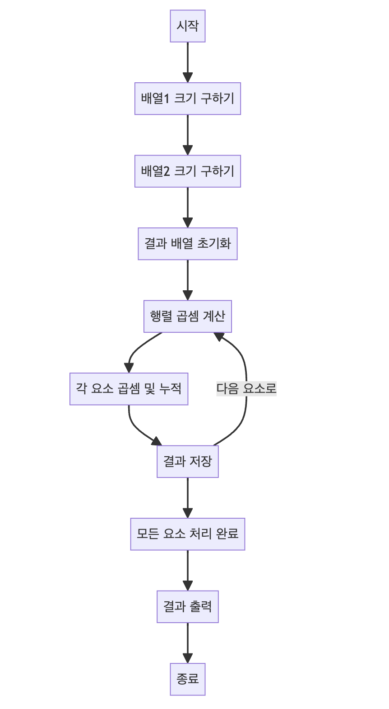

> [CH01_탐색_PART1](../) / [02_2차원_배열](./)

# 프로그래머스 : 행렬의 곱셈
> https://school.programmers.co.kr/learn/courses/30/lessons/12949?language=java

## 설계
- 행렬 내적은 두 개의 행렬을 곱하는 연산으로, 주어진 두 행렬 A와 B가 있을 때, 결과 행렬 C를 계산하는 방법이다. 이때 <mark>A의 열의 수와 B의 행의 수가 일치해야 한다.</mark>
- 먼저, 주어진 두 행렬 A와 B가 다음과 같다고 가정해 본다면,
    ```
    # 행렬 A (크기: m x n)
    a11  a12  a13
    a21  a22  a23
    ```
    ```
    # 행렬 B (크기: n x p)
    b11  b12
    b21  b22
    b31  b32
    ```
- 결과 행렬 C는 다음과 같은 크기를 가지게 된다: `m x p`
- 행렬 C의 각 원소 c<sub>ij</sub>는 다음과 같이 계산된다:
    ```
    cij = a[i1][j1] * b[i2][j2] + a[i1][j2] * b[i2][j2] + ... + a[i1][jn] * b[in][j2]
    # 여기서 i1, j1, i2, j2, ..., in, jn은 각각 A와 B의 원소를 가리키는 인덱스.
    ```
- 코드에서는 이러한 원리를 기반으로 중첩된 반복문을 사용하여 각 원소를 계산하고 결과 배열 C에 저장. 각 원소 c<sub>ij</sub>는 A의 행 i1과 B의 열 j2를 곱한 값들을 모두 더한 값이 된다.

## 구현


## 코드
### Java
```java
import java.util.*;

class Solution {
    public int[][] solution(int[][] arr1, int[][] arr2) {
        // 배열1의 행과 열 크기 구하기
        int row1 = arr1.length;       // 배열1의 행 수
        int col1 = arr1[0].length;    // 배열1의 열 수
        System.out.println("배열1 행 : " + row1);
        System.out.println("배열1 열 : " + col1);
        for (int[] r : arr1) {
            System.out.println(Arrays.toString(r));
        }
        // 배열2의 행과 열 크기 구하기
        int row2 = arr2.length;       // 배열2의 행 수
        int col2 = arr2[0].length;    // 배열2의 열 수
        System.out.println("배열2 행 : " + row2);
        System.out.println("배열2 열 : " + col2);
        for (int[] r : arr2) {
            System.out.println(Arrays.toString(r));
        }        
        // 결과를 저장할 새로운 배열 생성
        // 행렬 곱셈 결과는 배열1의 행과 배열2의 열 크기를 가집니다.
        int[][] answer = new int[row1][col2];
        
        // 각 행렬 요소의 곱셈과 덧셈을 계산
        for (int r1 = 0; r1 < row1; r1++) {
            for (int c2 = 0; c2 < col2; c2++) {
                int sum = 0; // 두 행렬의 곱셈 결과를 누적할 변수
                // 행렬 곱셈 수행
                for (int v = 0; v < col1; v++) {
                    sum += arr1[r1][v] * arr2[v][c2];
                }
                // 결과를 새로운 배열에 저장
                answer[r1][c2] = sum;
            }        
        }
        for (int[] r : answer) {
            System.out.println(Arrays.toString(r));
        } 
        // 결과 배열 반환
        return answer;
    }
}
```
### Python
```python
def solution(arr1, arr2):
    # 배열1의 행과 열 크기 구하기
    row1 = len(arr1)  # 배열1의 행 수
    col1 = len(arr1[0])  # 배열1의 열 수

    # 배열2의 행과 열 크기 구하기
    row2 = len(arr2)  # 배열2의 행 수
    col2 = len(arr2[0])  # 배열2의 열 수

    # 결과를 저장할 새로운 배열 생성
    # 행렬 곱셈 결과는 배열1의 행과 배열2의 열 크기를 가집니다.
    answer = [[0] * col2 for _ in range(row1)]

    # 각 행렬 요소의 곱셈과 덧셈을 계산
    for r1 in range(row1):
        for c2 in range(col2):
            sum_val = 0  # 두 행렬의 곱셈 결과를 누적할 변수
            # 행렬 곱셈 수행
            for v in range(col1):
                sum_val += arr1[r1][v] * arr2[v][c2]
            # 결과를 새로운 배열에 저장
            answer[r1][c2] = sum_val

    return answer
```