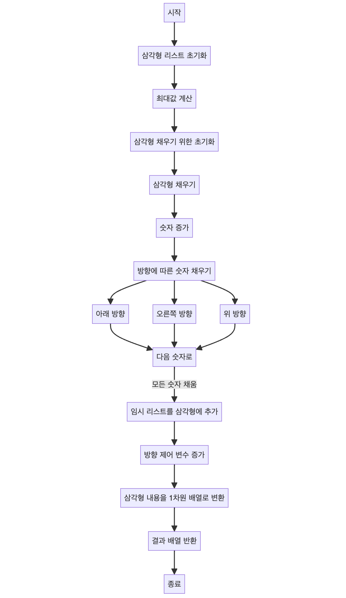

> [CH01_탐색_PART1](../) / [02_2차원_배열](./)

# 프로그래머스 : 삼각 달팽이
> https://school.programmers.co.kr/learn/courses/30/lessons/68645?language=java

## 설계
- 좌측하단, 우측, 좌측 상단으로 움직이는 3가지의 움직임 경우의 수를 각기 구현
- 개수가 정해져 있지 않은 경우이므로, Array 대신 List를 사용하여 구현
- get, add, addAll 등 list의 메소드들을 적절히 사용

## 구현


## 코드
### Java
```java
//package pg68645; // 패키지 선언

import java.util.ArrayList; // ArrayList 사용을 위한 import
// import java.util.Arrays; // Arrays 사용을 위한 import
import java.util.List; // List 사용을 위한 import

public class Solution {
    // n을 입력으로 받아 특정 규칙에 따라 채워진 삼각형 배열을 1차원 배열로 변환하여 반환하는 메소드
	public static int[] solution(int n) {
		List<List<Integer>> triangle = new ArrayList<>(); // 삼각형을 표현하기 위한 리스트
		int s = 0; // 삼각형에 들어갈 숫자의 최대값
		// 한 줄마다 1, 2, ... n 개의 숫자가 들어가므로 1 + ... + n 이 최대값

		// n크기의 삼각형을 만들기 위한 초기화
		for (int i = 0; i < n; i++) {
			triangle.add(new ArrayList<>()); // 삼각형의 각 라인을 ArrayList로 추가
			s += (i + 1); // 총합 갱신
		}
		// System.out.println(s); // 최대값 출력

		int num = 0; // 삼각형에 채울 숫자
		int d = 0; // 방향 제어 변수 (0: 아래, 1: 오른쪽, 2: 위)
		int r = 0; // 현재 행 위치
		List<Integer> temp = new ArrayList<>(); // 임시 리스트

		// 삼각형을 채우는 주요 반복문
		for (int i = 0; i < n; i++) {
			for (int j = i; j < n; j++) {
				num++; // 채울 숫자 증가
				// System.out.println(num); // 현재 숫자 출력
				// 방향에 따른 처리
				switch (d % 3) {
					case 0: { // 아래 방향으로 숫자 채움
						// System.out.println("1번, " + r);
						r++; // 행 위치 증가
						triangle.get(r-1).add(d / 3, num); // 숫자 채움
						break;
					}
					case 1: { // 오른쪽 방향으로 숫자 채움
						// System.out.println("2번, " + r);
						temp.add(num); // 임시 리스트에 숫자 추가
						break;
					}
					case 2: { // 위 방향으로 숫자 채움
						// System.out.println("3번, " + r);
						r--; // 행 위치 감소
						triangle.get(r-1).add(triangle.get(r-1).size() - d/3,num); // 숫자 채움
						break;
					}
				}
				// System.out.println(triangle); // 현재 삼각형 상태 출력
			}
			// 오른쪽 방향으로 숫자를 채운 후 임시 리스트의 내용을 삼각형에 추가
			if (d % 3 == 1) {
				triangle.get(r-1).addAll(d / 3 + 1, temp);
				temp.clear(); // 임시 리스트 초기화
			}
			d++; // 방향 제어 변수 증가
		}

		// 삼각형의 내용을 1차원 배열로 변환
		int[] arr = new int[s]; // 결과 배열
		int idx = 0; // 결과 배열의 인덱스
		for (List<Integer> i : triangle) { // 삼각형의 각 행에 대하여
			for (int j : i) { // 각 열의 요소에 대하여
				arr[idx++] = j; // 결과 배열에 숫자를 순서대로 채움
			}
		}
		return arr; // 결과 배열 반환
	}

//	public static void main(String[] args) {
//		// 테스트 케이스 출력
//		System.out.println(Arrays.toString(solution(4))); // n=4일 때의 결과
//		System.out.println(Arrays.toString(solution(5))); // n=5일 때의 결과
//		System.out.println(Arrays.toString(solution(6))); // n=6일 때의 결과
//	}
}
```
### Python
```python
def solution(n):
    # 삼각형의 모든 요소를 0으로 초기화
    triangle = [[0] * i for i in range(1, n+1)]
    x, y = -1, 0  # 시작 위치
    num = 1  # 시작 숫자
    
    # 각 방향별로 숫자를 채워 넣는 과정
    for i in range(n):
        for j in range(i, n):
            if i % 3 == 0:  # 아래로 이동
                x += 1
            elif i % 3 == 1:  # 오른쪽으로 이동
                y += 1
            else:  # 위로 이동
                x -= 1
                y -= 1
            triangle[x][y] = num
            num += 1

    # 삼각형을 1차원 배열로 변환
    answer = [num for row in triangle for num in row]
    return answer

# 테스트
# print(solution(4))  # n=4일 때 결과
# print(solution(5))  # n=5일 때 결과
# print(solution(6))  # n=6일 때 결과
```