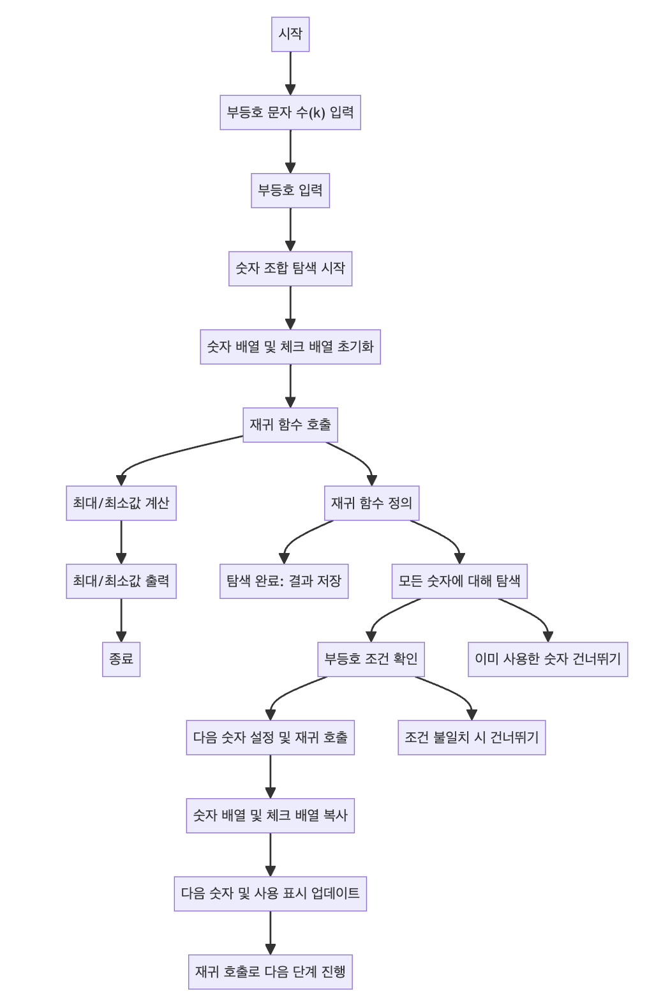

> [CH01_탐색_PART1](../) / [03_재귀](./)

# BOJ_2529 : 부등호
> https://www.acmicpc.net/problem/2529

## 설계
- 주어진 k개의 부등호 문자열을 만족하는 k+1 자리의 수를 찾는 문제를 해결.
- 각 숫자 위치에 0부터 9까지 가능한 숫자를 대입하면서 부등호 조건을 만족하는지 확인하고, 모든 조건을 만족하는 숫자 배열을 결과 리스트에 추가.
- 최종적으로 결과 리스트에 저장된 모든 배열을 문자열로 변환하여 숫자를 비교하고, 가능한 최대값과 최소값을 출력.
- 재귀 함수를 사용하여 가능한 모든 숫자 조합을 탐색하는데, 각 단계마다 사용한 숫자를 체크하고 부등호 조건을 만족하는지 확인.
- 탐색이 끝나면 결과를 리스트에 저장하고, 최종적으로 최대값과 최소값을 계산하여 출력

## 구현


## 코드
### Java
```java
// package boj2529; // 패키지 선언

import java.util.ArrayList; // ArrayList 사용을 위한 import
// import java.util.Arrays; // Arrays 사용을 위한 import
import java.util.List; // List 사용을 위한 import
import java.util.Scanner; // Scanner 사용을 위한 import

public class Main {

    // 메인 메소드
    public static void main(String[] args) {
        Scanner scanner = new Scanner(System.in); // 사용자 입력을 받기 위한 Scanner 객체 생성
        int k = scanner.nextInt(); // 부등호 문자의 수 입력
        sign = new String[k]; // 부등호를 저장할 배열 초기화
        for (int i = 0; i < k; i++) {
            sign[i] = scanner.next(); // 부등호 입력
        }
        // System.out.println(Arrays.toString(sign)); // 입력된 부등호 출력
        
        // 각 숫자에 대해 재귀적으로 탐색 시작
        for (int i = 0; i < 10; i++) {
            int[] nums = new int[k+1]; // 숫자를 저장할 배열
            nums[0] = i; // 첫 번째 숫자 초기화
            boolean[] checked = new boolean[10]; // 사용된 숫자 표시할 배열
            checked[i] = true; // 현재 숫자 사용 표시
            recursive(0, nums, checked); // 재귀 함수 호출
        }
        // 최대, 최소값 초기화
        String maxVal = "0".repeat(k+1);
        String minVal = "9".repeat(k+1);
        // 모든 결과에 대해 최대값, 최소값 계산
        for (int[] r : result) {
            // System.out.println(Arrays.toString(r)); // 결과 출력
            String s = arrToString(r); // 결과 배열을 문자열로 변환
            // 최대값, 최소값 갱신
            maxVal = Long.parseLong(maxVal) < Long.parseLong(s) ? s : maxVal;
            minVal = Long.parseLong(minVal) > Long.parseLong(s) ? s : minVal;
        }
        // 최대값, 최소값 출력
        System.out.println(maxVal);
        System.out.println(minVal);
        scanner.close(); // Scanner 객체 닫기
    }
    
    public static String[] sign; // 부등호 문자열 저장할 배열
    public static List<int[]> result = new ArrayList<>(); // 결과를 저장할 리스트
    
    // 배열을 문자열로 변환하는 메소드
    public static String arrToString(int[] r) {
        String s = ""; // 문자열 초기화
        for (int i : r) {
            s += i; // 각 숫자를 문자열에 추가
        }
        return s; // 완성된 문자열 반환
    }
    
    // 재귀 함수 정의
    public static void recursive(int idx, int[] nums, boolean[] checked) {
        // 탐색이 끝났을 경우 결과 리스트에 추가하고 반환
        if (sign.length == idx) {
            result.add(nums);
            return;
        }
        // 모든 숫자에 대해 탐색
        for (int i = 0; i < 10; i++) {
            if (checked[i]) continue; // 이미 사용한 숫자는 건너뛰기
            // 부등호 조건에 맞지 않는 경우 건너뛰기
            if (sign[idx].equals(">")) {
                if (nums[idx] < i) continue;
            }
            if (sign[idx].equals("<")) {
                if (nums[idx] > i) continue;
            }
            int[] nums_ = nums.clone(); // 현재까지의 숫자 배열 복사
            nums_[idx+1] = i; // 다음 숫자 설정
            boolean[] checked_ = checked.clone(); // 사용한 숫자 배열 복사
            checked_[i] = true; // 현재 숫자 사용 표시
            recursive(idx+1, nums_, checked_); // 다음 단계로 재귀 호출
        }
    }
}
```
### Python
```python
def arr_to_string(arr):
    return ''.join(map(str, arr))


def recursive(idx, nums, checked):
    if idx == len(sign):
        result.append(nums.copy())
        return

    for i in range(10):
        if checked[i]:
            continue

        if sign[idx] == ">":
            if nums[idx] < i:
                continue
        elif sign[idx] == "<":
            if nums[idx] > i:
                continue

        nums[idx + 1] = i
        checked[i] = True
        recursive(idx + 1, nums, checked)
        checked[i] = False

k = int(input())
sign = input().split()
result = []

for i in range(10):
    nums = [-1] * (k + 1)
    nums[0] = i
    checked = [False] * 10
    checked[i] = True
    recursive(0, nums, checked)

max_val = ''.join(map(str, max(result)))
min_val = ''.join(map(str, min(result)))

print(max_val)
print(min_val)
```