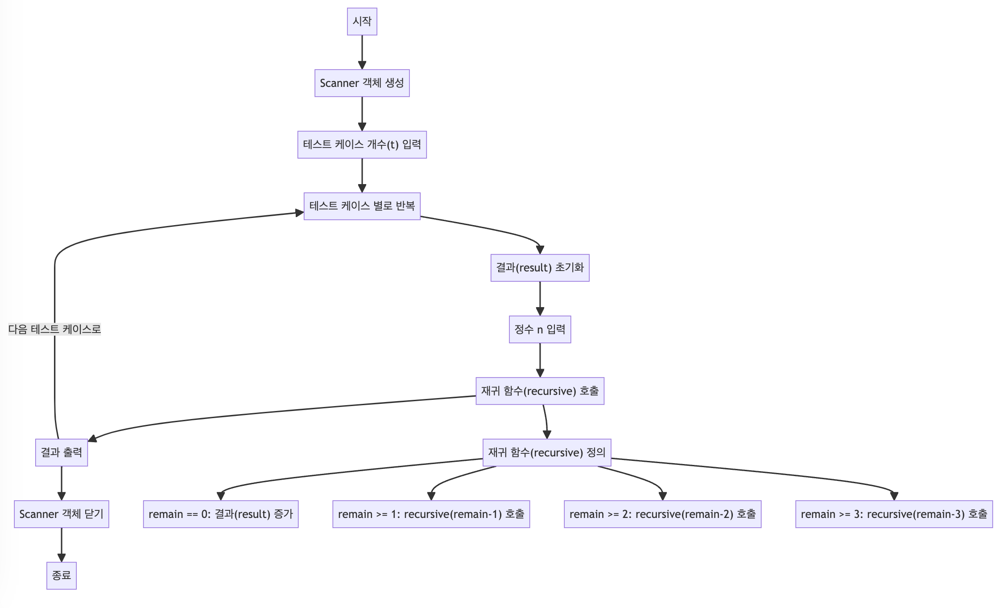

> [CH01_탐색_PART1](../) / [03_재귀](./)

# BOJ_9095 : 1, 2, 3 더하기
> https://www.acmicpc.net/problem/9095

## 설계
- 정수 n을 입력 받아, 1, 2, 3의 합으로 n을 만드는 모든 경우의 수를 찾는 문제를 해결.
- 재귀 함수는 종료 조건에 도달할 때까지 자기 자신을 호출하며 문제의 규모를 점차 줄여 나가는 구조.
- 재귀적으로 문제를 해결하는 과정에서 n이 0이 될 때마다 하나의 유효한 조합을 찾은 것으로 간주하고 결과를 카운트
- 재귀 호출은 1, 2, 3을 각각 n에서 빼는 것을 반복하며, 각 단계에서 가능한 모든 경우의 수를 탐색.

## 구현


## 코드
### Java
```java
// package boj9095; // 패키지 선언

import java.util.Scanner; // Scanner 클래스 임포트

public class Main {
    // 주요 실행 메소드
    public static void main(String[] args) {
        Scanner scanner = new Scanner(System.in); // 사용자 입력을 받기 위한 Scanner 객체 생성
        int t = scanner.nextInt(); // 테스트 케이스 개수 입력

        // 각 테스트 케이스에 대한 처리
        for (int i = 0; i < t; i++) {
            result = 0; // 결과 초기화
            int n = scanner.nextInt(); // 정수 n 입력 받음
            // System.out.println("n : " + n); // 입력 받은 n 출력
            recursive(n); // 재귀 함수 호출
            System.out.println(result); // 결과 출력
        }
        scanner.close(); // Scanner 객체 닫기
    }
    
    public static int result = 0; // 결과를 저장하는 전역 변수
    
    // 재귀 함수 정의
    public static void recursive(int remain) {
        // 재귀 종료 조건: remain이 0이 될 경우, 결과 변수를 1 증가시킴
        if (remain == 0) {		
            result++;
        }
        // remain이 1 이상일 경우, 1을 빼고 재귀 호출
        if (remain >= 1) {
            recursive(remain - 1);
        }
        // remain이 2 이상일 경우, 2를 빼고 재귀 호출
        if (remain >= 2) {			
            recursive(remain - 2);
        }
        // remain이 3 이상일 경우, 3을 빼고 재귀 호출
        if (remain >= 3) {
            recursive(remain - 3);
        }
    }
}
```
### Python
```python
def recursive(remain):
    global result
    if remain == 0:
        result += 1  # 재귀 종료 조건: 남은 값(remain)이 0일 때, 결과를 1 증가시킴

    if remain >= 1:
        recursive(remain - 1)  # 남은 값이 1 이상일 경우, 1을 빼고 재귀 호출

    if remain >= 2:
        recursive(remain - 2)  # 남은 값이 2 이상일 경우, 2를 빼고 재귀 호출

    if remain >= 3:
        recursive(remain - 3)  # 남은 값이 3 이상일 경우, 3을 빼고 재귀 호출

t = int(input())
result = 0  # 결과를 저장할 전역 변수 초기화

for _ in range(t):
    n = int(input())  # 정수 n을 입력 받음
    recursive(n)  # 재귀 함수 호출하여 가능한 조합 계산
    print(result)  # 결과 출력
    result = 0  # 다음 테스트 케이스를 위해 결과 변수 초기화
```