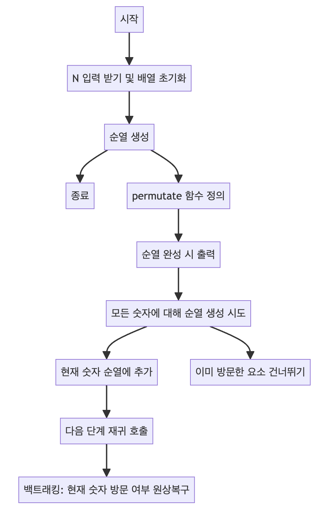

> [CH01_탐색_PART1](../) / [04_순열과_조합](./)

# BOJ_10974 : 모든 순열
> https://www.acmicpc.net/problem/10974

## 설계
- 주어진 정수 N에 대해 1부터 N까지의 모든 숫자를 사용하여 만들 수 있는 모든 순열을 생성하고 출력
- 순열 : N개의 숫자를 일렬로 나열하는 것
- 모든 숫자는 한 번씩만 나타나야 하며, 순서에 따라 다른 순열이 됨
- permutate라는 재귀 메소드를 사용하여 가능한 모든 조합을 시도하고, 이미 사용한 숫자는 visited 배열을 통해 체크
- 각 순열이 완성될 때마다 이를 출력하며, 모든 순열을 찾을 때까지 이 과정을 반복합니다.

## 구현


## 코드
### Java
```java
// package boj10974; // 패키지 선언

// import java.util.Arrays; // 자바 유틸 Arrays 클래스 임포트
import java.util.Scanner; // Scanner 클래스 임포트
import java.util.stream.IntStream; // IntStream 클래스 임포트

public class Main {

    // 메인 메소드
    public static void main(String[] args) {
        Scanner sc = new Scanner(System.in); // 사용자 입력을 받기 위한 Scanner 객체 생성
        N = sc.nextInt(); // 사용자로부터 숫자 N 입력 받기
        sc.close(); // Scanner 객체 닫기
        
        arr = IntStream.range(1, N + 1).toArray(); // 1부터 N까지의 배열 생성
        permutate(new int[N], new boolean[N], 0); // 순열 생성 함수 호출
    }

    static int N; // 순열을 생성할 숫자의 개수
    static int[] arr; // 순열 생성에 사용할 기본 배열 (1부터 N까지)

    // 순열을 생성하는 재귀 메소드
    public static void permutate(int[] tmp, boolean[] visited, int depth) {
        // 기저 사례: depth가 N에 도달했을 때 순열 출력
        if (depth == N) {
            // System.out.println(Arrays.toString(tmp)); // 배열 형태로 순열 출력
            StringBuilder sb = new StringBuilder(); // 출력 형식을 위한 StringBuilder
            // 순열을 공백으로 구분하여 문자열로 만듦
            for (int el : tmp) {
                sb.append(el);
                sb.append(" ");
            }
            System.out.println(sb.toString().trim()); // 생성된 순열을 문자열로 출력
            return;
        }
        // 모든 숫자에 대해 순열 생성 시도
        for (int i = 0; i < N; i++) {
            if (visited[i]) { // 이미 방문한 요소는 건너뛰기
                continue;
            }
            tmp[depth] = arr[i]; // 현재 숫자를 순열에 추가
            visited[i] = true; // 현재 숫자 방문 처리
            permutate(tmp, visited, depth + 1); // 다음 숫자로 넘어가며 재귀 호출
            visited[i] = false; // 백트래킹을 위해 방문 여부 원상복구
        }
    }
}
```
### Python
```python
from itertools import permutations

N = int(input())  # 사용자로부터 숫자 N 입력 받기
arr = list(range(1, N + 1))  # 1부터 N까지의 배열 생성

# 순열 생성 함수 호출 및 출력
for perm in permutations(arr):
    print(*perm)
```