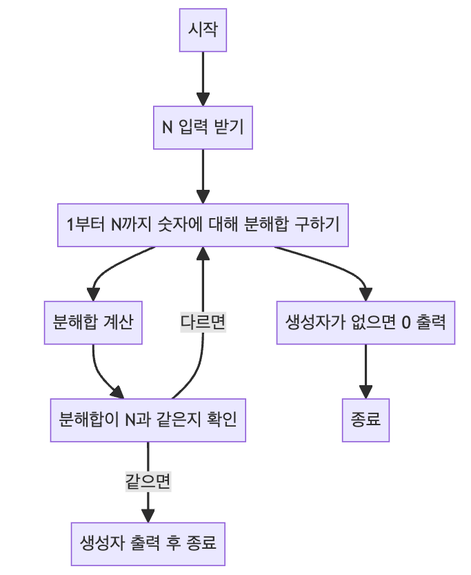

> [CH01_탐색_PART1](../) / [11_DAY01](./)

# BOJ_2231 : 분해합
> https://www.acmicpc.net/problem/2231

## 설계
- 분해합은 어떤 수와 그 수의 각 자리수를 모두 더한 값
- 주어진 N 값에 대하여 1부터 N까지 모든 숫자의 분해합을 구하며, 해당 분해합이 N과 같은 경우 해당 숫자를 출력
- 가장 작은 값으로부터 시작하기 때문에 최소 조건을 만족
- 이렇게 출력되는 숫자는 N의 "생성자". 만약 생성자가 없는 경우 0을 출력.

## 구현


## 코드
### Java
```java
// package boj2231; // 패키지 선언

import java.util.Scanner; // 사용자 입력을 받기 위한 Scanner 클래스 임포트
import java.util.stream.Stream; // 스트림을 사용하기 위한 Stream 클래스 임포트

public class Main {

    // 메인 메소드
    public static void main(String[] args) {
        Scanner sc = new Scanner(System.in); // 사용자로부터 입력을 받기 위해 Scanner 객체 생성
        int N = sc.nextInt(); // 사용자로부터 분해합을 구할 N 값을 입력받음
        sc.close(); // Scanner 객체를 닫음
        
        // 1부터 N까지 각 숫자에 대해 분해합을 구함
        for (int i = 1; i <= N; i++) {
            // 분해합 계산: 숫자 자체(i)와 그 숫자의 각 자리수의 합
            int s = Stream.of((i + "").split("")) // 숫자를 문자열로 변환하고 한 자리씩 나눔
                    .map((v) -> Integer.valueOf(v)) // 각 자릿수 문자를 정수로 변환
                    .reduce((v1, v2) -> v1 + v2) // 모든 자릿수 합산
                    .get(); // 스트림 결과값 얻기
            // 구한 분해합이 입력값 N과 같으면 i를 출력 (i는 N의 생성자)
            if (i + s == N) {
                System.out.println(i); // 생성자 i 출력
                return; // 프로그램 종료
            }
        }
        // 생성자가 없을 경우 0 출력
        System.out.println(0);
    }
}
```
### Python
```python
N = int(input())  # 사용자로부터 분해합을 구할 N 값을 입력받음

# 1부터 N까지 각 숫자에 대해 분해합을 구함
for i in range(1, N + 1):
    # 분해합 계산: 숫자 자체(i)와 그 숫자의 각 자리수의 합
    s = sum(map(int, str(i)))  # 각 자리수 문자를 정수로 변환하고 합산
    # 구한 분해합이 입력값 N과 같으면 i를 출력 (i는 N의 생성자)
    if i + s == N:
        print(i)  # 생성자 i 출력
        break
else:
    # 생성자가 없을 경우 0 출력
    print(0)
```