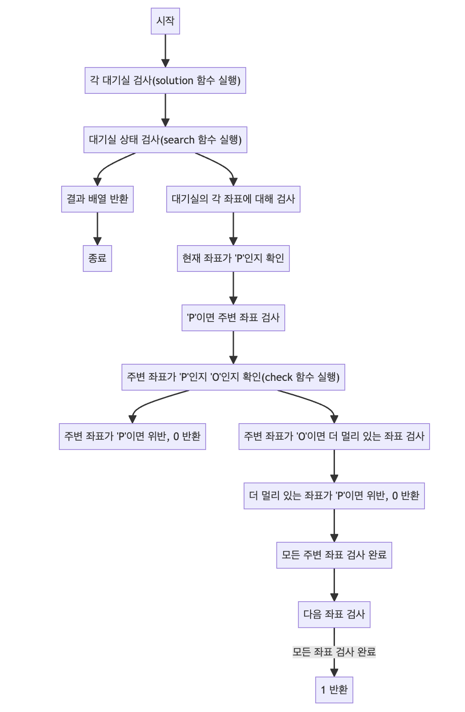

> [CH01_탐색_PART1](../) / [12_DAY02](./)

# 프로그래머스 : 거리두기 확인하기
> https://school.programmers.co.kr/learn/courses/30/lessons/81302?language=java

## 설계
- 주어진 장소 배열(places)에 대한 거리두기 규칙 준수 여부를 검사
- 각 장소 배열은 5x5 크기의 문자 배열로, 각 문자는 'P', 'O', 'X' 중 하나
- solution 메소드는 각 장소 배열에 대해 search 함수를 호출하여 거리두기 준수 여부를 확인하고, 이를 결과 배열에 저장
- search 함수는 각 위치를 순회하며, 'P'(사람이 있는 자리) 주변에 다른 'P'가 규정된 거리 안에 있는지 검사
- 위반 사항이 있으면 즉시 0을 반환하고, 모든 위치가 규칙을 준수하면 1을 반환

## 구현


## 코드
### Java
```java
// package pg81302; // 패키지 선언

import java.util.Arrays; // Arrays 클래스 사용을 위한 import

public class Solution {
    static int size = 5; // 배열의 크기를 나타내는 상수
    static int[] answer = new int[size]; // 각 테스트 케이스의 결과를 저장할 배열

    // 문제의 해결을 위한 메소드
    public static int[] solution(String[][] places) {
        // 모든 테스트 케이스에 대해
        for (int i = 0; i < 5; i++) {
            String[] place = places[i]; // 각 테스트 케이스를 나타내는 배열
            answer[i] = search(place); // search 함수를 사용하여 결과 계산
        }
        return answer; // 계산된 결과 반환
    }

    // 주어진 위치가 유효한지 확인하고, 상태를 반환하는 메소드
    public static int check(String[] place, int r, int c) {
        // 주어진 위치가 배열 범위를 벗어나면 0 반환
        if (r == size || r < 0) {
            return 0;
        }
        if (c == size || c < 0) {
            return 0;
        }
        // 위치에 따른 상태 반환
        switch (place[r].charAt(c)) {
            case 'O':
                return 1;
            case 'P':
                return 2;
        }
        return 0;
    }

    static int[][] d = { { 0, 1 }, { 0, -1 }, { -1, 0 }, { 1, 0 } }; // 방향을 나타내는 배열

    // 각 테스트 케이스에서 거리두기를 지키고 있는지 검사하는 메소드
    public static int search(String[] place) {
        // System.out.println(Arrays.toString(place));
        // 모든 위치에 대해
        for (int r = 0; r < size; r++) {
            for (int c = 0; c < size; c++) {
                char current = place[r].charAt(c); // 현재 위치의 상태
                // System.out.println(r + " " + c + " " + current);
                if (current != 'P') // 'P'가 아니면 검사할 필요 없음
                    continue;
                // 모든 방향에 대해
                for (int[] el : d) {
                    int r1 = r + el[0];
                    int c1 = c + el[1];
                    // 인접한 칸에 대해 상태 확인
                    switch (check(place, r1, c1)) {
                        case 2:
                            return 0; // 'P'가 바로 옆에 있으면 0 반환
                        case 1:
                            // 'O'가 있는 경우, 인접한 다른 칸들도 확인
                            for (int[] el2 : d) {
                                int r2 = r1 + el2[0];
                                int c2 = c1 + el2[1];
                                /// 자기 자신일 경우 생략
                                if (r == r2 && c == c2) {
                                    continue;
                                }
                                if (check(place, r2, c2) == 2) {
                                    return 0; // 빈 칸을 통해 'P'가 인접한 경우 0 반환
                                }
                            }
                    }
                }
            }
        }
        // 모든 조건을 만족하면 1 반환
        return 1;
    }

    // 메인 메소드 - 테스트 케이스를 출력
    // public static void main(String[] args) {
	// 	String[][] input = { { "POOOP", "OXXOX", "OPXPX", "OOXOX", "POXXP" },
	// 			{ "POOPX", "OXPXP", "PXXXO", "OXXXO", "OOOPP" }, { "PXOPX", "OXOXP", "OXPOX", "OXXOP", "PXPOX" },
	// 			{ "OOOXX", "XOOOX", "OOOXX", "OXOOX", "OOOOO" }, { "PXPXP", "XPXPX", "PXPXP", "XPXPX", "PXPXP" } };
	// 	System.out.println(Arrays.toString(solution(input)));
	// }
}
```
### Python
```python
# 문제 해결을 위한 함수
def solution(places):
    size = 5  # 배열의 크기를 나타내는 상수
    answer = []  # 각 테스트 케이스의 결과를 저장할 리스트

    # 주어진 위치가 유효한지 확인하고, 상태를 반환하는 함수
    def check(place, r, c):
        # 주어진 위치가 배열 범위를 벗어나면 0 반환
        if r == size or r < 0:
            return 0
        if c == size or c < 0:
            return 0
        # 위치에 따른 상태 반환
        if place[r][c] == 'O':
            return 1
        if place[r][c] == 'P':
            return 2
        return 0

    # 각 테스트 케이스에서 거리두기를 지키고 있는지 검사하는 함수
    def search(place):
        directions = [(0, 1), (0, -1), (-1, 0), (1, 0)]  # 방향을 나타내는 리스트

        # 모든 위치에 대해 검사
        for r in range(size):
            for c in range(size):
                current = place[r][c]  # 현재 위치의 상태
                if current != 'P':  # 'P'가 아니면 검사할 필요 없음
                    continue

                # 모든 방향에 대해 검사
                for dr, dc in directions:
                    r1, c1 = r + dr, c + dc  # 인접한 칸의 위치
                    # 인접한 칸에 대한 상태 확인
                    if check(place, r1, c1) == 2:
                        return 0  # 'P'가 바로 옆에 있으면 0 반환
                    if check(place, r1, c1) == 1:
                        # 'O'가 있는 경우, 인접한 다른 칸들도 확인
                        for dr2, dc2 in directions:
                            r2, c2 = r1 + dr2, c1 + dc2  # 다른 인접한 칸의 위치
                            if (r, c) == (r2, c2):
                                continue
                            if check(place, r2, c2) == 2:
                                return 0  # 빈 칸을 통해 'P'가 인접한 경우 0 반환
        # 모든 조건을 만족하면 1 반환
        return 1

    # 모든 테스트 케이스에 대해 검사
    for place in places:
        answer.append(search(place))
    return answer

# 테스트 케이스 예시
# places = [["POOOP", "OXXOX", "OPXPX", "OOXOX", "POXXP"],
#           ["POOPX", "OXPXP", "PXXXO", "OXXXO", "OOOPP"],
#           ["PXOPX", "OXOXP", "OXPOX", "OXXOP", "PXPOX"],
#           ["OOOXX", "XOOOX", "OOOXX", "OXOOX", "OOOOO"],
#           ["PXPXP", "XPXPX", "PXPXP", "XPXPX", "PXPXP"]]
# print(solution(places))
```