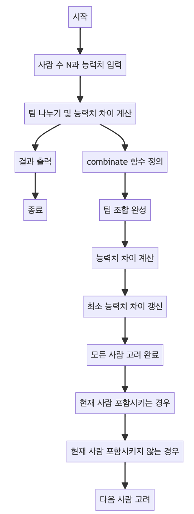

> [CH01_탐색_PART1](../) / [13_DAY03](./)

# BOJ_14889 : 스타트와 링크
> https://www.acmicpc.net/problem/14889

## 설계
- N명의 사람을 두 팀으로 나누어, 각 팀의 능력치 합의 차이가 최소가 되도록 팀을 구성하는 문제를 해결.
- 사람들 간의 능력치는 2차원 배열 arr에 저장되며, 각 팀 구성은 boolean 배열 tmp로 나타냄.
- combinate 메소드는 재귀적으로 모든 팀 조합을 생성하고, 각 조합에 대한 능력치 차이를 계산하여 최소 차이 power를 찾음.
- 코드 실행이 완료되면, 최소 능력치 차이를 출력.

## 구현


## 코드
### Java
```java
// package boj14889; // 패키지 선언

// import java.util.Arrays; // 자바 유틸 Arrays 클래스 임포트
import java.util.Scanner; // Scanner 클래스 임포트

public class Main {
	
    // 메인 메소드
	public static void main(String[] args) {
		Scanner sc = new Scanner(System.in); // 사용자 입력을 받기 위한 Scanner 객체 생성
		N = sc.nextInt(); // 사람 수 N 입력 받기
		arr = new int[N][N]; // 능력치를 저장할 2차원 배열 초기화
		
		// N명의 사람들에 대한 능력치 입력 받기
		for (int i = 0; i < N; i++) {
			for (int j = 0; j < N; j++) {
				arr[i][j] = sc.nextInt(); // 각 사람들 간의 능력치 입력
			}
		}
		// 입력된 능력치 배열 출력
		// Arrays.stream(arr).forEach((v) -> System.out.println(Arrays.toString(v)));
		sc.close(); // Scanner 객체 닫기
		
		// 팀을 나누어 최소 능력치 차이를 계산하는 함수 호출
		combinate(new boolean[N], 0, 0);
		System.out.println(power); // 계산된 최소 능력치 차이 출력
	}
	
	static int N; // 사람 수
	static int[][] arr; // 사람들 간의 능력치 배열
	static int power = Integer.MAX_VALUE; // 최소 능력치 차이를 저장할 변수, 초기값은 최대 정수값으로 설정
	
    // 팀을 나누고, 능력치 차이를 계산하는 함수
	public static void combinate(boolean[] tmp, int index, int depth) {
		// 팀 조합이 완성된 경우
		if (depth == N / 2) {
			// System.out.println(Arrays.toString(tmp)); // 현재 팀 조합 출력
			int tmpPower = 0; // 현재 조합의 능력치 차이 계산
			// 모든 조합에 대한 능력치 차이 계산
			for (int i = 0; i < tmp.length; i++) {
				for (int j = 0; j < tmp.length; j++) {
					if (i == j) continue; // 같은 사람은 제외
					if (tmp[i] == tmp[j]) { // 같은 팀인 경우
						tmpPower += arr[i][j] * (tmp[i] ? 1 : -1); // 능력치 더하기
					}
				}
			}
			tmpPower = Math.abs(tmpPower); // 능력치 차이의 절대값 계산
			// System.out.println(tmpPower); // 현재 조합의 능력치 차이 출력
			power = tmpPower < power ? tmpPower : power; // 최소 능력치 차이 갱신
			return;
		}
		// 모든 사람을 다 고려한 경우
		if (index == N) {
			return;
		}
		// 현재 사람을 포함시키는 경우
		tmp[index] = true;
		combinate(tmp, index + 1, depth + 1);
		// 현재 사람을 포함시키지 않는 경우
		tmp[index] = false;
		combinate(tmp, index + 1, depth);
	}
}
```
### Python
```python
def combinate(tmp, index, depth):
    global power
    # 팀 조합이 완성된 경우
    if depth == N // 2:
        tmpPower = 0  # 현재 조합의 능력치 차이 계산
        # 모든 조합에 대한 능력치 차이 계산
        for i in range(len(tmp)):
            for j in range(len(tmp)):
                if i == j:
                    continue  # 같은 사람은 제외
                if tmp[i] == tmp[j]:  # 같은 팀인 경우
                    tmpPower += arr[i][j] * (1 if tmp[i] else -1)  # 능력치 더하기
        tmpPower = abs(tmpPower)  # 능력치 차이의 절대값 계산
        power = min(tmpPower, power)  # 최소 능력치 차이 갱신
        return
    # 모든 사람을 다 고려한 경우
    if index == N:
        return
    # 현재 사람을 포함시키는 경우
    tmp[index] = True
    combinate(tmp, index + 1, depth + 1)
    # 현재 사람을 포함시키지 않는 경우
    tmp[index] = False
    combinate(tmp, index + 1, depth)


# 입력 받기
N = int(input())  # 사람 수 입력 받기
arr = []  # 능력치를 저장할 2차원 리스트 초기화

# N명의 사람들에 대한 능력치 입력 받기
for i in range(N):
    row = list(map(int, input().split()))  # 한 줄의 능력치를 리스트로 입력 받음
    arr.append(row)  # 현재 줄의 능력치를 arr에 추가

power = float('inf')  # 최소 능력치 차이를 저장할 변수, 초기값은 무한대로 설정

# 팀을 나누어 최소 능력치 차이를 계산하는 함수 호출
combinate([False] * N, 0, 0)
print(power)  # 계산된 최소 능력치 차이 출력
```