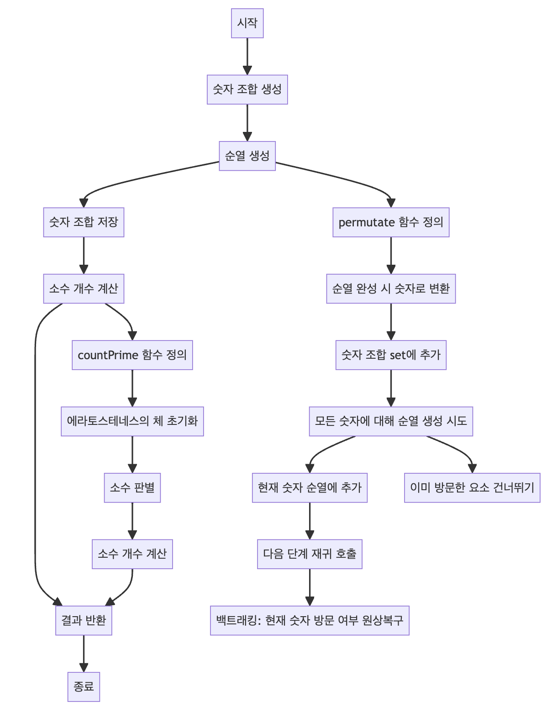

> [CH01_탐색_PART1](../) / [14_DAY04](./)

# 프로그래머스 : 소수 찾기
> https://school.programmers.co.kr/learn/courses/30/lessons/42839?language=java

## 설계
- 문자열로 주어진 숫자들을 이용하여 만들 수 있는 모든 숫자 조합 중 소수의 개수를 찾는 문제를 해결
- 각 숫자 조합은 모든 자리수의 순열을 생성하여 set에 저장
- permutate 함수는 주어진 숫자로 가능한 모든 순열을 재귀적으로 생성
- 생성된 각 숫자 조합에 대해 에라토스테네스의 체를 사용하여 소수를 판별
- 생성된 모든 숫자 조합에 대해 에라토스테네스의 체를 적용하여 해당 숫자가 소수인지 판별하고, 최종적으로 소수의 개수를 반환
    - 에라토스테네스의 체는 여러 개의 자연수에 대하여 소수를 판별할 때 사용하는 알고리즘
    - 소수가 되는 수의 배수를 순차적으로 제거해 가며 소수만을 남기는 방식으로, 특정 범위 내에서의 모든 소수를 찾을 때 효과적

## 구현


## 코드
### Java
```java
// package pg42839; // 패키지 선언

import java.util.Arrays; // Arrays 클래스 임포트
import java.util.HashSet; // HashSet 클래스 임포트
import java.util.Set; // Set 인터페이스 임포트

public class Solution {

    // 메인 메소드
	// public static void main(String[] args) {
	// 	System.out.println(solution("17")); // "17"을 사용한 솔루션 결과 출력
	// 	System.out.println(solution("011")); // "011"을 사용한 솔루션 결과 출력
	// }
	
	static int N; // 주어진 숫자의 길이
	static Set<Integer> set = new HashSet<>(); // 숫자 조합을 저장할 집합
	
	// 솔루션 메소드
	public static int solution(String numbers) {
		N = numbers.length(); // 주어진 숫자의 길이
		set.clear(); // set 초기화
		int[] arr = new int[N]; // 숫자를 저장할 배열
		
		// 주어진 숫자를 한 자리씩 배열에 저장
		for (int i = 0; i < N; i++) {
			arr[i] = Integer.parseInt(numbers.substring(i, i+1));
		}
		System.out.println(Arrays.toString(arr)); // 배열 상태 출력
		
		// 1자리부터 N자리까지 가능한 모든 숫자 조합 생성
		for (int r = 1; r <= N; r++) {			
			permutate(arr, new int[r], new boolean[N], 0, r);
		}
		System.out.println(set); // 생성된 숫자 조합 출력
		return countPrime(); // 소수의 개수 계산 및 반환
	}
		
	// 순열 생성 메소드
	public static void permutate(int[] arr, int[] tmp, boolean[] visited, int depth, int r) {
		if (depth == r) {
			// 순열이 완성되면 숫자로 변환하여 set에 추가
			String s = "";
			for (int v : tmp) {
				s += v;
			}
			set.add(Integer.valueOf(s));
			return;
		}
		// 모든 숫자에 대해 순열 생성 시도
		for (int i = 0; i < N; i++) {
			if (visited[i]) continue;
			tmp[depth] = arr[i];
			visited[i] = true;
			permutate(arr, tmp, visited, depth + 1, r);
			visited[i] = false;
		}
	}
	
	// 소수의 개수를 계산하는 메소드
	public static int countPrime() {
		// 에라토스테네스의 체 초기화
		boolean[] prime = new boolean[set.stream().max(Comparator.naturalOrder()).get() + 1];
		Arrays.fill(prime, true);
		prime[0] = prime[1] = false;
		// 에라토스테네스의 체를 사용하여 소수 판별
		for (int i = 2; i < prime.length; i++) {
			if (prime[i]) {
				for (int j = i * 2; j < prime.length; j += i) {
					prime[j] = false;
				}
			}
		}
		// 소수의 개수 계산
		int count = 0;
		for (int v : set) {
			if (prime[v]) count++;
		}
		return count; // 소수 개수 반환
	}
}
```
### Python
```python
from itertools import permutations

def solution(numbers):
    # 솔루션 메소드 정의

    N = len(numbers)  # 주어진 숫자의 길이
    _set = set()  # 숫자 조합을 저장할 집합

    # 1자리부터 N자리까지 가능한 모든 숫자 조합 생성
    for r in range(1, N + 1):
        for combo in permutations(numbers, r):
            num = int(''.join(combo))  # 순열을 숫자로 변환
            _set.add(num)  # 변환된 숫자를 set에 추가

    return countPrime(_set)  # 소수의 개수 계산 및 반환

def countPrime(_set):
    # 소수의 개수를 계산하는 메소드

    if not _set:  # set이 비어있는 경우
        return 0

    max_num = max(_set)  # 생성된 숫자 중 최댓값
    prime = [True] * (max_num + 1)  # 에라토스테네스의 체 초기화
    prime[0], prime[1] = False, False  # 0과 1은 소수가 아님

    # 에라토스테네스의 체를 사용하여 소수 판별
    for i in range(2, int(max_num ** 0.5) + 1):
        if prime[i]:
            for j in range(i*i, len(prime), i):
                prime[j] = False

    # 소수의 개수 계산
    count = sum(1 for num in _set if prime[num])

    return count  # 소수 개수 반환

# 예제 실행
# sol = Solution()
# print(sol.solution("17"))  # "17"을 사용한 솔루션 결과 출력
# print(sol.solution("011"))  # "011"을 사용한 솔루션 결과 출력
```