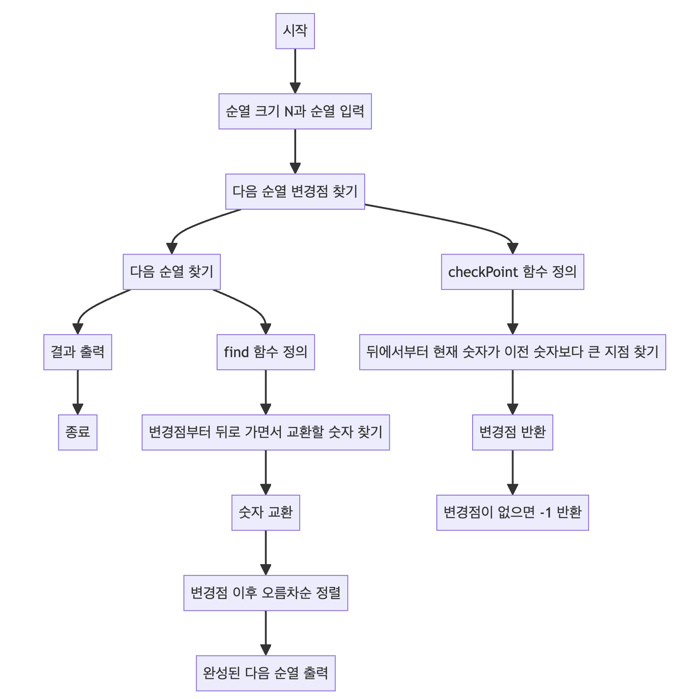

> [CH01_탐색_PART1](../) / [15_DAY05](./)

# BOJ_10972 : 다음 순열
> https://www.acmicpc.net/problem/10972

## 설계
- 주어진 순열에 대해 사전순으로 바로 다음에 오는 순열을 찾아 출
- 순열의 "다음"이라는 것은 사전순으로 바로 다음에 오는 순서를 의미.
- 먼저 순열에서 뒤쪽부터 탐색하여 이전 숫자보다 현재 숫자가 처음으로 커지는 지점을 찾음.
- 이 지점을 변경점(cp)으로 하여, 변경점의 숫자보다 큰 숫자 중 가장 뒤에 있는 숫자와 변경점의 숫자를 교환
- 이후 변경점 이후의 숫자들을 오름차순으로 정렬. 이렇게 하여 얻어진 순열이 입력된 순열의 다음 순열이 됨.
- 만약 다음 순열이 존재하지 않으면, 즉 주어진 순열이 사전순으로 마지막 순열이면 -1을 출력

## 구현


## 코드
### Java
```java
// package boj10972; // 패키지 선언

import java.util.ArrayList; // ArrayList 클래스 임포트
import java.util.Arrays; // Arrays 클래스 임포트
import java.util.List; // List 인터페이스 임포트
import java.util.Scanner; // Scanner 클래스 임포트

public class Main {

    // 메인 메소드
    public static void main(String[] args) {
        Scanner sc = new Scanner(System.in); // 사용자 입력을 받기 위한 Scanner 객체 생성
        N = sc.nextInt(); // 순열의 크기 N 입력 받기
        arr = new int[N]; // 순열을 저장할 배열 초기화
        
        // 순열 입력 받기
        for (int i = 0; i < N; i++) {
            arr[i] = sc.nextInt(); // 숫자 입력
        }
        sc.close(); // Scanner 객체 닫기
        
        // System.out.println(Arrays.toString(arr)); // 입력된 순열 출력
        int cp = checkPoint(); // 다음 순열의 변경점 찾기
        if (cp == -1) { // 변경점이 없으면 -1 출력 후 종료
            System.out.println(-1);
            return;
        }
        // System.out.println(cp); // 변경점 출력
        
        find(cp); // 변경점을 기준으로 다음 순열 찾기
    }

    static int N; // 순열의 크기
    static int[] arr; // 순열 배열

    // 다음 순열의 변경점을 찾는 메소드
    static int checkPoint() {
        // 뒤에서부터 현재 숫자가 이전 숫자보다 큰 지점 찾기
        for (int i = 1; i < N; i++) {
            int idx = N - i;
            if (arr[idx - 1] < arr[idx]) {
                return idx; // 변경점 반환
            }
        }
        return -1; // 변경점이 없으면 -1 반환
    }

    // 다음 순열을 찾아 출력하는 메소드
    static void find(int cp) {
        // 변경점부터 뒤로 가면서 교환할 숫자 찾기
        for (int r = N - 1; r > 0; r--) {
            if (arr[cp - 1] < arr[r]) {
                // 숫자 교환
                int tmp = arr[r];
                arr[r] = arr[cp - 1];
                arr[cp - 1] = tmp;
                
                // 변경점 이전은 그대로 두고, 변경점 이후는 오름차순으로 정렬
                List<Integer> l = new ArrayList<>();
                Arrays.stream(Arrays.copyOfRange(arr, 0, cp))
                    .forEach(l::add); // 변경점 이전 부분 추가
                Arrays.stream(Arrays.copyOfRange(arr, cp, N))
                    .sorted()
                    .forEach(l::add); // 변경점 이후 정렬하여 추가
                StringBuilder sb = new StringBuilder();
                l.forEach((v) -> sb.append(v + " "));
                
                // 완성된 다음 순열 출력
                System.out.println(sb.toString().strip());
                return;
            }
        }
    }
}
```
### Python
```python
# 주어진 배열에서 다음 순열을 찾기 위한 함수입니다.
def seperate(arr, c):
    # 배열의 뒤에서부터 앞으로 이동하면서
    for i in range(1, c):
        n = c - i
        # 순서가 증가하는 지점을 찾습니다. 
        if arr[n-1] < arr[n]: return n
    # 찾지 못했으면 -1을 반환합니다 (더 이상 다음 순열이 없음).
    return -1

# n 위치에서 순서를 바꾼 후 배열의 나머지 부분을 정렬합니다.
def find(arr, n):
    r = 0
    while True:
        r -= 1
        # 오른쪽부터 왼쪽으로 이동하며 arr[n-1]보다 큰 첫 번째 원소를 찾습니다.
        if arr[n-1] < arr[r]:
            # 원소를 서로 교환합니다.
            tmp = arr[r]
            arr[r] = arr[n-1]
            arr[n-1] = tmp
            # 배열의 앞부분은 그대로 두고, n 이후 부분은 정렬하여 반환합니다.
            return arr[0:n] + sorted(arr[n:])

# 입력을 받습니다. c는 배열의 길이, arr는 배열입니다.
c = int(input())
arr = [int(v) for v in input().strip().split()]

# 배열에서 다음 순열의 시작점을 찾습니다.
n = seperate(arr, c)
if(n != -1):
    # 시작점이 있다면, 다음 순열을 찾아 출력합니다.
    print(" ".join([str(i) for i in find(arr, n)]))
else: 
    # 더 이상 다음 순열이 없으면 -1을 출력합니다.
    print(n)
```